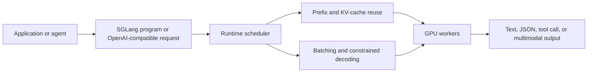

# SGLang

SGLang is an open-source serving framework for large language and multimodal models. It is useful when a team wants to self-host open models with high throughput, low latency, structured outputs, prefix reuse, and GPU-aware scheduling. It sits in the same serving-runtime layer as [vLLM](vllm.md), with more emphasis on structured generation programs and prompt-tree execution. Conceptually, it sits below application orchestration frameworks such as [LangChain](langchain.md) or [LangGraph](langgraph.md): those frameworks decide what the system should do, while SGLang focuses on executing model calls efficiently.

SGLang has two sides:

| Side              | Role                                                                                                                                              |
| ----------------- | ------------------------------------------------------------------------------------------------------------------------------------------------- |
| Frontend language | Expresses generation programs with prompts, generation calls, control flow, parallel branches, and structured output constraints.                 |
| Runtime engine    | Executes those programs with GPU scheduling, [KV-cache](kv-cache.md) reuse, batching, memory management, parallelism, and decoding optimizations. |

The important point is that SGLang is not a model architecture. It is an inference/runtime layer for serving models.

## Why it exists

Simple demos often look like one call:

```text
prompt -> model.generate() -> answer
```

Here `prompt` is the text or multimodal input sent to the model, `model.generate()` is the inference call that produces tokens, and `answer` is the decoded output returned to the application.

Production generative systems rarely stay that simple. A [RAG](rag.md) product may run retrieval, reranking, answer generation, citation checks, and a fallback. An agent may call the model repeatedly with a shared system prompt, tool schemas, intermediate observations, and structured action objects. A batch evaluator may run thousands of similar prompts that share the same prefix.

Without a runtime designed for this shape, the serving stack can repeatedly recompute the same prompt prefixes, waste GPU memory, under-batch requests, and treat structured decoding as an expensive afterthought. SGLang is designed for these complex generation programs rather than only isolated text completions.

## Runtime path



The application still owns product behavior: routing, permissions, retrieval, tool authorization, validation, logging, and user-visible fallbacks. SGLang owns the model execution path.

## Core ideas

| Idea                                  | What it means                                                                                         | Why it matters                                                                                                                 |
| ------------------------------------- | ----------------------------------------------------------------------------------------------------- | ------------------------------------------------------------------------------------------------------------------------------ |
| RadixAttention                        | A prefix-cache mechanism that reuses [KV cache](kv-cache.md) across prompt trees and shared prefixes. | Repeated system prompts, few-shot examples, tool schemas, and conversation prefixes do not need to be recomputed from scratch. |
| Continuous batching                   | The runtime batches active requests as they arrive and progress.                                      | GPU utilization improves compared with serving each request separately.                                                        |
| Structured output decoding            | Decoding can be constrained to schemas, JSON-like structures, or finite-state constraints.            | The serving layer can produce machine-readable outputs with fewer malformed responses.                                         |
| Paged attention and memory management | KV-cache memory is managed so concurrent requests can share limited GPU memory more effectively.      | Long prompts and many simultaneous requests become more tractable.                                                             |
| Prefill/decode optimization           | The expensive prompt-processing phase and token-generation phase can be optimized separately.         | Long-context workloads and high-throughput serving have different bottlenecks.                                                 |
| Parallelism and hardware support      | Deployments can use tensor, pipeline, expert, or data parallelism depending on model and hardware.    | Very large models and high-traffic services need more than one accelerator.                                                    |
| OpenAI-compatible serving             | Applications can often call the server through familiar API shapes.                                   | Migration from a hosted API or another local serving stack can be incremental.                                                 |

## Example: shared-prefix RAG

Imagine a support assistant that uses the same system prompt, policy instructions, JSON schema, and citation format for every request. Only the retrieved evidence and user question change.

```text
shared prefix:
  system policy
  answer schema
  citation rules
  tool descriptions

per request:
  retrieved policy chunks
  customer question
```

The `shared prefix` block is identical or nearly identical across many calls, so it is a good candidate for prefix-cache reuse. The `per request` block changes for each user query, so it still has to be processed for each request.

A naive serving path may process the shared prefix again for every request. SGLang's prefix caching is designed to reuse that work when requests share prompt structure. This is especially valuable when the shared prefix is large: a long system prompt, many tool schemas, few-shot examples, or a multi-turn conversation history.

The same example also explains why structured decoding matters. If downstream code expects

```json
{
  "answer": "...",
  "citations": ["policy:refunds:2026-07"],
  "needs_human_review": false
}
```

then the runtime should help produce valid structure, while application code still validates the schema and checks that citations really support the answer. In this object, `answer` is the user-visible text, `citations` is the list of evidence identifiers that should support the answer, and `needs_human_review` is a boolean routing signal for the application.

## Where SGLang fits

| Need                                    | SGLang's role                                                                                                                  |
| --------------------------------------- | ------------------------------------------------------------------------------------------------------------------------------ |
| Self-host an open model                 | Runs model inference on owned or rented hardware.                                                                              |
| Reduce repeated prefill work            | Reuses shared prefixes through cache-aware execution.                                                                          |
| Serve structured outputs                | Provides constrained decoding support, but the application should still validate.                                              |
| Support agentic or multi-call workflows | Executes repeated and branching model calls efficiently.                                                                       |
| Optimize GPU serving                    | Handles batching, memory, decoding, parallelism, and hardware-specific paths.                                                  |
| Replace product orchestration           | Not the right layer; use application code, [LangGraph](langgraph.md), or another orchestrator for business flow and state.     |
| Replace retrieval or guardrails         | Not the right layer; retrieval, authorization, policy checks, and [guardrails](guardrails.md) remain separate system concerns. |

## SGLang and vLLM

[vLLM](vllm.md) and SGLang are both self-hosted serving runtimes. vLLM is often the general-purpose starting point for OpenAI-compatible high-throughput serving. SGLang is often attractive when the workload is naturally a structured generation program: shared prompt trees, constrained outputs, multi-call flows, and explicit generation logic. The right choice depends on the model, hardware, prompt shape, output length, and application control surface, so benchmark the real workload rather than relying on framework labels.

## When to consider it

SGLang is worth evaluating when:

- You self-host open-weight language or multimodal models.
- Prompt prefixes are long and reused across requests.
- Workloads need structured outputs, tool-call-like JSON, or constrained decoding.
- Throughput and tail latency matter enough to tune the serving stack.
- You need multi-GPU or hardware-specific deployment control.
- You run agent, RAG, evaluation, or post-training rollout workloads with many related generations.

It is probably unnecessary when a hosted model API already meets quality, latency, privacy, and cost requirements. It can also be overkill for a small internal script where a simpler local inference wrapper is good enough.

## Operational caveats

Serving frameworks are not magic latency reducers. Benchmarks depend on the model, context length, batch shape, output length, hardware, quantization, attention backend, and traffic pattern. A result from one model or GPU generation may not transfer to another.

SGLang also adds operational responsibility: model compatibility, driver versions, GPU memory sizing, queue limits, autoscaling, observability, retries, rollout, and security. OpenAI-compatible endpoints can ease integration, but they do not remove the need to test streaming behavior, schema failures, tokenizer differences, and [determinism](determinism-and-reproducibility.md).

Treat SGLang as part of the [model serving](model-serving.md) layer. The application still needs input validation, prompt-injection defenses, access control, privacy rules, output validation, citations, and incident handling.

## Quick comparison

| Layer                     | Example tools                           | Owns                                                                    |
| ------------------------- | --------------------------------------- | ----------------------------------------------------------------------- |
| Application orchestration | Product code, LangGraph, LangChain      | User flow, state, tools, retrieval, policy, fallbacks.                  |
| Serving runtime           | SGLang, vLLM, TensorRT-LLM-style stacks | GPU scheduling, batching, KV cache, decoding, model execution.          |
| Model artifact            | Llama, Qwen, DeepSeek, custom fine-tune | Weights, tokenizer, architecture, context length, supported modalities. |
| Infrastructure            | Kubernetes, batch jobs, cloud GPUs      | Placement, capacity, networking, secrets, monitoring, cost controls.    |

## References

- [SGLang documentation](https://docs.sglang.io/)
- [SGLang GitHub repository](https://github.com/sgl-project/sglang)
- [Zheng et al. 2024, SGLang: Efficient Execution of Structured Language Model Programs](https://arxiv.org/abs/2312.07104)

> [!nav]
> **Section** — [Generative AI and Agentic Systems](index.md)
>
> [← vLLM](vllm.md) [Quantization →](quantization.md)
