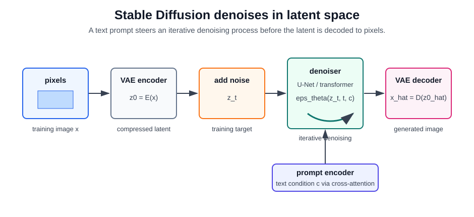

# Stable Diffusion

Stable Diffusion is a family of text-conditioned image-generation models built around latent diffusion. Instead of denoising full-resolution pixels directly, the model compresses an image into a lower-dimensional latent representation, denoises that latent under text conditioning, and decodes the final latent back to pixels. That latent-space design is the practical reason Stable Diffusion-style systems can produce high-resolution images with less compute than pixel-space diffusion.

Stable Diffusion sits between [generative AI](index.md) and [computer vision](../09-computer-vision/index.md). The generator is a diffusion model, but it depends on visual representation learning: an [autoencoder](../06-deep-learning/autoencoders.md) defines the image latent space, a text or vision-language encoder supplies conditioning, and the denoiser learns visual structure from large image corpora. For representation-side context, see [self-supervised visual learning](../09-computer-vision/self-supervised-visual-learning.md).

## Defining mechanism

A latent diffusion model first encodes an image $x$ into a latent:

$$
z_0 = E(x),
$$

where $E$ is usually an [autoencoder](../06-deep-learning/autoencoders.md) encoder. The forward diffusion process adds Gaussian noise:

$$
q(z_t\mid z_0)=
\mathcal N\!\left(\sqrt{\bar\alpha_t}z_0,\;(1-\bar\alpha_t)I\right).
$$

The denoising model receives the noisy latent $z_t$, timestep $t$, and conditioning $c$ from a prompt encoder, then predicts the noise:

$$
\mathcal L =
\mathbb E_{z_0,t,\epsilon,c}
\left[
\left\lVert
\epsilon-\epsilon_\theta(z_t,t,c)
\right\rVert_2^2
\right].
$$

At sampling time, the model starts from noise $z_T$ and repeatedly applies a scheduler step using $\epsilon_\theta$ until it obtains a clean latent $\hat z_0$. A decoder $D$ maps that latent back to an image:

$$
\hat x = D(\hat z_0).
$$

## Guidance

Text conditioning is commonly strengthened with classifier-free guidance. The denoiser is trained sometimes with the text condition and sometimes without it. During sampling, the two predictions are combined:

$$
\epsilon_{cfg}
=
\epsilon_\theta(z_t,t,\varnothing)
+ w\left(
\epsilon_\theta(z_t,t,c)-\epsilon_\theta(z_t,t,\varnothing)
\right).
$$

Here $w$ is the guidance scale. Larger $w$ usually makes the image follow the prompt more strongly, but it can reduce diversity, over-sharpen textures, or amplify artifacts. A negative prompt is an engineering variant: replace the empty condition $\varnothing$ with a condition describing what the sample should move away from.

## Architecture Variants

| component    | classic latent-diffusion Stable Diffusion                                                     | later variants                                                                                             |
| ------------ | --------------------------------------------------------------------------------------------- | ---------------------------------------------------------------------------------------------------------- |
| Image space  | Autoencoder compresses pixels into a spatial latent and decodes final latents back to pixels. | The latent-space principle remains common, though autoencoder details change.                              |
| Denoiser     | U-Net with residual blocks, attention, timestep embedding, and cross-attention to text.       | Larger U-Nets in SDXL; diffusion-transformer or rectified-flow backbones in newer systems.                 |
| Conditioning | Text encoder produces prompt embeddings exposed through cross-attention.                      | Multiple text encoders, richer conditioning, image conditioning, control maps, or multimodal token mixing. |
| Sampler      | Iterative denoising schedule over timesteps.                                                  | Faster samplers, distillation, consistency-style methods, or rectified-flow trajectories.                  |

The important conceptual point is stable across variants: generation is an iterative denoising process in a learned visual latent space, steered by a conditioning signal.

## Worked sampling scenario

For a prompt such as "a watercolor sketch of a glass greenhouse at sunrise," the system follows this path:

| stage           | representation             | role                                                                                |
| --------------- | -------------------------- | ----------------------------------------------------------------------------------- |
| Prompt encoding | Text embeddings $c$        | Encodes concepts such as watercolor, greenhouse, glass, and sunrise.                |
| Initial latent  | Random noise $z_T$         | Provides stochastic variation; different seeds start from different noise.          |
| Denoising loop  | Latents $z_t$              | Repeatedly removes noise while cross-attention steers the latent toward the prompt. |
| Guidance        | $\epsilon_{cfg}$           | Trades prompt adherence against diversity and artifact risk.                        |
| Decoding        | Image $\hat x=D(\hat z_0)$ | Converts the final latent into RGB pixels.                                          |

Image-to-image and inpainting use the same mechanism with a different starting point: encode an existing image, add a controlled amount of noise, and denoise under the prompt or mask constraints. More noise gives the model more freedom; less noise preserves more of the original image.

## Caveats

Stable Diffusion is not a factual image database. It can invent details, reproduce dataset biases, struggle with exact text, count objects poorly, or produce anatomically inconsistent results. Prompt adherence, aesthetic quality, and diversity trade off through sampling settings and guidance. For product use, evaluate copyright/licensing constraints, safety filters, demographic bias, prompt injection through image-editing workflows, and whether generated images need provenance or watermarking.

## References

- [Ho et al., 2020, Denoising Diffusion Probabilistic Models](https://arxiv.org/abs/2006.11239)
- [Rombach et al., 2021, High-Resolution Image Synthesis with Latent Diffusion Models](https://arxiv.org/abs/2112.10752)
- [Ho and Salimans, 2022, Classifier-Free Diffusion Guidance](https://arxiv.org/abs/2207.12598)
- [Radford et al., 2021, Learning Transferable Visual Models From Natural Language Supervision](https://arxiv.org/abs/2103.00020)
- [Podell et al., 2023, SDXL: Improving Latent Diffusion Models for High-Resolution Image Synthesis](https://arxiv.org/abs/2307.01952)
- [Esser et al., 2024, Scaling Rectified Flow Transformers for High-Resolution Image Synthesis](https://arxiv.org/abs/2403.03206)
