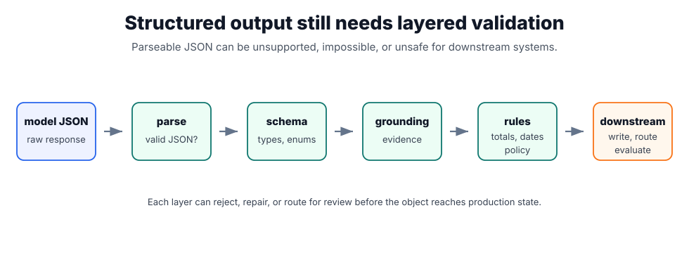

# Structured Output

Structured output asks the model to return data in a parseable shape, usually JSON matching a schema. It is essential when output feeds [tool use](tool-use-and-function-calling.md), databases, workflows, [model serving](model-serving.md) validators, or evaluation harnesses. The goal is not pretty JSON; the goal is to make model output safe to inspect with ordinary software.

## What a schema constrains

The schema defines fields, types, required keys, enums, and whether extra properties are allowed. Generation can be constrained by the provider, but applications should still validate the parsed object. [Tool schemas](tool-schemas.md) use the same idea for model-proposed tool calls.

[LangChain](langchain.md) can request schema-bound final outputs from an agent, while [LangGraph](langgraph.md) often uses structured outputs as state updates or routing decisions between nodes. In both cases, schema validity is only the first check.



Read the diagram as a validation pipeline. Parsing asks whether the response is syntactically JSON; schema validation asks whether it has the right fields and types; grounding asks whether important values are supported by evidence; business rules ask whether the object is allowed in the domain. Only after those layers should downstream systems write, route, or evaluate the object.

## Schema Example

```json
{
  "type": "object",
  "required": ["merchant", "total", "currency"],
  "properties": {
    "merchant": { "type": "string" },
    "total": { "type": "number" },
    "currency": { "type": "string", "enum": ["EUR", "USD", "GBP"] }
  },
  "additionalProperties": false
}
```

For the record `{"merchant":"Miro Cafe","total":12.4,"currency":"EUR"}`, all required fields are present, the amount is numeric, and the currency is allowed. The record `{"merchant":"Miro Cafe","total":"12.40"}` fails even though it is parseable JSON: `total` is a string, `currency` is missing, and a downstream payment or accounting system should reject it before business logic runs.

| Check                       | Catches                                                                             |
| --------------------------- | ----------------------------------------------------------------------------------- |
| JSON parsing                | Broken syntax.                                                                      |
| Schema validation           | Missing fields, wrong types, invalid enums, unexpected fields.                      |
| Source-grounding validation | Values not supported by the input document.                                         |
| Business-rule validation    | Impossible totals, unsupported currencies, duplicate records, or policy violations. |

The last two checks are the reason schema validity is not enough: valid JSON can still be semantically wrong, and only source-grounding and business-rule validation catch a well-formed record that misreports reality.

## Realistic extraction example

Suppose an invoice assistant reads a PDF and returns:

```json
{
  "merchant": "Miro Cafe",
  "invoice_date": "2026-07-18",
  "line_items": [{ "description": "team lunch", "amount": 92.4, "currency": "EUR" }],
  "total": 92.4,
  "currency": "EUR",
  "evidence": [{ "field": "total", "page": 1, "text": "Total EUR 92.40" }]
}
```

This shape is useful because it includes both normalized fields and evidence pointers. The application can check that every money field has a currency, that line-item totals reconcile to `total`, that the date is inside the allowed accounting period, and that sensitive fields are handled according to [data privacy](data-privacy.md) rules.

## Design rules

- Prefer narrow schemas with explicit enums and required fields.
- For extraction, include evidence spans or page references for fields that matter.
- Use `additionalProperties: false` when downstream systems should reject unexpected fields.
- Represent uncertainty explicitly, for example `confidence` or `needs_review`, instead of letting the model hide uncertainty in prose.
- Validate business invariants after schema validation.
- Version schemas when they feed persistent storage or workflow automation.

## Failure modes

Structured output can fail by refusing to parse, fitting the schema but inventing values, dropping uncertain fields, over-normalizing important details, or producing values that are valid but impossible in the business domain. If the output drives a tool call or database write, failed validation should block the action, not ask the model to "try harder" indefinitely.

## References

- [OpenAI API documentation: Structured outputs](https://platform.openai.com/docs/guides/structured-outputs)
- [JSON Schema documentation: object](https://json-schema.org/understanding-json-schema/reference/object)
- [OpenAI API documentation: Function calling](https://platform.openai.com/docs/guides/function-calling)

> [!nav]
> **Section** — [Generative AI and Agentic Systems](index.md)
>
> [← Determinism and Reproducibility](determinism-and-reproducibility.md) [RAG →](rag.md)
