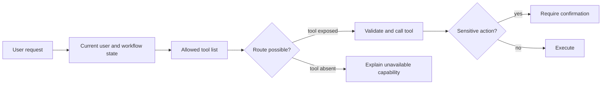

# Tool Routing

Tool routing decides whether a request should be answered directly, sent to retrieval, or handled by an external tool. In [agent loops](agent-loops.md), routing connects [planning](planning.md) to [tool use and function calling](tool-use-and-function-calling.md). A good router selects a capability without exceeding the user's authority.

## What a route contains

Routing can be rule-based, model-based, or hybrid. The route should include tool name, arguments, confidence, and required confirmation. [Tool schemas](tool-schemas.md) validate arguments, while [guardrails](guardrails.md) enforce permissions and side-effect policy.

[LangChain](langchain.md) is useful when model-selected tools fit a standard agent loop. [LangGraph](langgraph.md) is useful when routes must become explicit graph transitions, especially for deterministic branches, retries, human review, or side-effecting tools.

## Route fields

A route should be an explicit object, not hidden prose:

```json
{
  "intent": "policy_lookup",
  "tool": "search_refund_policy",
  "arguments": {
    "query": "enterprise refund approval threshold",
    "policy_version": "2026-07"
  },
  "confidence": 0.86,
  "requires_confirmation": false,
  "reason": "question asks what policy says; no side effect requested"
}
```

The `reason` is useful for debugging, but it is not enforcement. The runtime still validates arguments, permissions, and side effects.

## Routing approaches

| Approach    | How the route is chosen                | Best when                                   |
| ----------- | -------------------------------------- | ------------------------------------------- |
| Rule-based  | keyword, pattern, or intent classifier | few tools; high-stakes or regulated routing |
| Model-based | the model selects a tool from schemas  | many tools; open-ended requests             |
| Hybrid      | rules gate, model chooses within scope | most production systems                     |

A safe default is hybrid: deterministic rules decide what is _allowed_ (permissions, side-effect confirmation) and the model chooses _which_ allowed tool fits — so a routing mistake can never exceed the caller's authorization.

## Routing decision tree

1. Is the request unsafe or out of scope? Refuse or escalate.
2. Does the request require fresh, private, or auditable facts? Route to retrieval or a read-only data tool.
3. Does it request a side effect? Check eligibility, require confirmation, then expose the action tool.
4. Is the request ambiguous? Ask a clarification rather than guessing.
5. If no tool is needed, answer directly.

This decision tree is deliberately conservative. Wrongly answering directly is often recoverable; wrongly executing a side effect is not.

## Worked routing table

| User request                 | Intent signal         | Route           | Required argument check                          |
| ---------------------------- | --------------------- | --------------- | ------------------------------------------------ |
| `weather in Berlin`          | Weather lookup        | `get_weather`   | Location is present.                             |
| `refund order 52`            | Side-effecting refund | `create_refund` | Order ID and user authorization must be checked. |
| `what is your return policy` | Policy question       | `search_docs`   | Query can be answered from documentation.        |

The table maps three inputs to distinct tools: weather lookup, refund creation, and document search. That is the contract a model router must satisfy too: choose the route from the user's intent, then provide arguments that match the selected tool's schema.

## Realistic ambiguous request

User:

```text
Can you handle the refund for order 52?
```

This could mean "tell me the policy," "draft a refund," or "execute a refund." A robust router should not jump straight to `create_refund`. It can first route to `lookup_order` and `search_refund_policy`, then ask for confirmation before any mutating tool becomes available. The route should reflect both intent and risk.

## Tool availability as capability

The active tool list defines what the agent can actually do. Suppose a field-monitoring assistant sees this scoped tool set:



```json
{
  "allowed_tools": [
    "search_observations",
    "get_observation",
    "mark_observation_reviewed",
    "create_followup_task"
  ]
}
```

For the request "find unreviewed reef-temperature anomalies, mark the matching observation reviewed, and create a follow-up task," the route can be valid: search, read, mark, create. For "delete the calibration outlier," the same assistant should not pretend it deleted anything, because no deletion route exists. It can search for the observation and report that deletion is unavailable in this state.

Adding a `delete_observation` tool changes the capability boundary:

```json
{
  "intent": "delete_observation",
  "tool": "delete_observation",
  "arguments": { "observation_id": "obs_1842" },
  "requires_confirmation": true,
  "reason": "the user requested a destructive data-curation action"
}
```

This is why tool routing is not only semantic classification. It is also capability scoping. Protocol layers such as MCP can make the available tools discoverable, but the application still decides which tools are exposed for the current user, tenant, risk level, and workflow state.

## Evaluation

Routing is evaluated with intent-labeled examples and trace checks. Useful metrics include correct direct-answer rate, correct tool-selection rate, unnecessary tool-call rate, clarification rate on ambiguous requests, and forbidden-route rate. For side-effecting tools, a single unauthorized route should fail the test case even if execution is later blocked.

## Caveats

Similar tool descriptions cause wrong calls. Never let a model route to tools the user is not authorized to use. Tool lists also become harder as they grow: if two tools differ only by subtle prose, the router will eventually choose the wrong one. Split capabilities by business action and use deterministic gates for high-risk branches.

## References

- [OpenAI API documentation: Using tools](https://platform.openai.com/docs/guides/tools)
- [OpenAI API documentation: Function calling](https://platform.openai.com/docs/guides/function-calling)
- [OpenAI API documentation: Agents SDK](https://platform.openai.com/docs/guides/agents)
- [Model Context Protocol specification: Tools](https://modelcontextprotocol.io/specification/2026-07-28/server/tools)

> [!nav]
> **Section** — [Generative AI and Agentic Systems](index.md)
>
> [← Tool Schemas](tool-schemas.md) [Agent Loops →](agent-loops.md)
