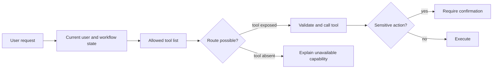

# Tool Routing

Tool routing decides whether a request should be answered directly, sent to retrieval, or handled by an external tool. In [agent loops](agent-loops.md), routing connects [planning](planning.md) to [tool use and function calling](tool-use-and-function-calling.md). A good router selects a capability without exceeding the user's authority.

## What a route contains

Routing can be rule-based, model-based, or hybrid. The route should include tool name, arguments, confidence, and required confirmation. [Tool schemas](tool-schemas.md) validate arguments, while [guardrails](guardrails.md) enforce permissions and side-effect policy.

[LangChain](langchain.md) is useful when model-selected tools fit a standard agent loop. [LangGraph](langgraph.md) is useful when routes must become explicit graph transitions, especially for deterministic branches, retries, human review, or side-effecting tools.

## Route fields

A route should be an explicit object, not hidden prose:

```json
{
  "intent": "policy_lookup",
  "tool": "search_refund_policy",
  "arguments": {
    "query": "enterprise refund approval threshold",
    "policy_version": "2026-07"
  },
  "confidence": { "value": 0.86, "source": "intent_classifier_v3" },
  "requires_confirmation": false,
  "reason": "question asks what policy says; no side effect requested"
}
```

The `reason` is useful for debugging, but it is not enforcement. The runtime still validates arguments, permissions, and side effects.

Record where `confidence` comes from. A confidence the model states about itself is poorly calibrated and should not gate anything. Usable sources are a trained intent classifier's probability, token log-probabilities where the API exposes them, or agreement across several sampled routes. Calibrate any threshold on labeled examples before using it.

## Routing approaches

| Approach             | How the route is chosen                                             | Best when                                              |
| -------------------- | ------------------------------------------------------------------- | ------------------------------------------------------ |
| Rule-based           | keyword, pattern, or intent classifier                              | few tools; high-stakes or regulated routing            |
| Model-based          | the model selects a tool from schemas                               | many tools; open-ended requests                        |
| Hybrid               | rules gate, model chooses within scope                              | most production systems                                |
| Retrieve-then-choose | search the tool catalog, expose only the top matches, model chooses | dozens to thousands of tools, such as many MCP servers |

A safe default is hybrid: deterministic rules decide what is _allowed_ (permissions, side-effect confirmation) and the model chooses _which_ allowed tool fits — so a routing mistake can never exceed the caller's authorization.

## Routing at scale

Routing gets harder as the catalog grows, and 2025 benchmarks built on real MCP servers measure this directly:

| Source                                   | Finding                                                                                                                                                                                                                                                                                                                                                    |
| ---------------------------------------- | ---------------------------------------------------------------------------------------------------------------------------------------------------------------------------------------------------------------------------------------------------------------------------------------------------------------------------------------------------------- |
| LiveMCPBench (Mo et al., 2025)           | 95 daily tasks over 70 MCP servers with 527 tools. The best of 12 models (Claude Sonnet 4) reached 78.95% task success; most reached 30–50%. Retrieval errors caused nearly half of all failures, and using the right combination of tools correlated strongly with success.                                                                               |
| MCP-Bench (Wang et al., 2025)            | 28 live MCP servers with 250 tools, and instructions that do not name the tool. It scores schema use, trajectory planning, and task completion separately. All 20 models tested showed persistent weaknesses.                                                                                                                                              |
| Berkeley Function-Calling Leaderboard v4 | The standard function-calling leaderboard. It now covers multi-turn interactions, format sensitivity, and agentic tasks such as web search in addition to single calls. Its synthetic schemas are cleaner than many real MCP servers.                                                                                                                      |
| Anthropic, 2025 (vendor-reported)        | Five common MCP servers with 58 tools took about 55,000 tokens of definitions. Loading tools on demand through a search tool cut that by about 85% and raised accuracy on an internal MCP evaluation from 49% to 74% (Opus 4) and from 79.5% to 88.1% (Opus 4.5). Recommended when definitions exceed about 10,000 tokens or there are more than 10 tools. |

The lesson is that selecting a tool from a large catalog is a retrieval problem before it is a reasoning problem. Practical steps:

- **Consolidate and namespace tools.** Build tools around business actions rather than wrapping every API endpoint. Prefix names by service and resource (`orders_lookup`, `refunds_create`) so similar tools are distinguishable.
- **Write descriptions for retrieval.** Name the inputs, outputs, and when _not_ to use the tool. Small description edits change routing noticeably, so treat them as tested code.
- **Retrieve, then choose.** Search the catalog with BM25 or embeddings, expose the top few tools, and let the model choose among them. Keep a few always-loaded tools for the most common actions.
- **Return compact results.** Paginate, filter, and truncate tool outputs so one call does not flood the context. See [harnesses](harnesses.md).

## A hybrid router

The router below composes the three layers:

1. A deterministic gate removes tools the caller may not use, including side-effecting tools without confirmation.
2. Embedding-based tool search narrows the allowed set to the best matches for the request.
3. The model sees only those candidate schemas and either picks one or asks a question. The runtime rejects any tool that was not offered.

```python
from __future__ import annotations

import json
import os
from collections.abc import Callable
from dataclasses import dataclass
from typing import Any

import numpy as np
from openai import OpenAI

from support_tools import (  # your tool implementations
    observations_delete,
    orders_lookup,
    policy_search_refunds,
    refunds_create,
    weather_get,
)

MODEL = os.environ.get("OPENAI_MODEL", "gpt-4o")
EMBEDDING_MODEL = "text-embedding-3-small"
ROLE_RANK = {"viewer": 0, "agent": 1, "admin": 2}
client = OpenAI()


@dataclass(frozen=True)
class Tool:
    fn: Callable[..., Any]
    schema: dict[str, Any]
    side_effect: bool = False
    required_role: str = "viewer"


def function_schema(name: str, description: str, properties: dict[str, Any]) -> dict[str, Any]:
    return {
        "type": "function",
        "name": name,
        "description": description,
        "parameters": {
            "type": "object",
            "properties": properties,
            "required": list(properties),
            "additionalProperties": False,
        },
        "strict": True,
    }


order_id = {"order_id": {"type": "string"}}
CATALOG = [
    Tool(orders_lookup, function_schema(
        "orders_lookup", "Look up an order by ID: status, amount, customer.", order_id)),
    Tool(policy_search_refunds, function_schema(
        "policy_search_refunds", "Search the refund policy for rules and approval thresholds.",
        {"query": {"type": "string"}})),
    Tool(refunds_create, function_schema(
        "refunds_create", "Issue a refund for an order. Only after the customer confirmed.",
        {**order_id, "amount_usd": {"type": "number"}}), side_effect=True, required_role="agent"),
    Tool(weather_get, function_schema(
        "weather_get", "Current weather for a city.", {"city": {"type": "string"}})),
    Tool(observations_delete, function_schema(
        "observations_delete", "Delete a sensor observation.", {"observation_id": {"type": "string"}}),
        side_effect=True, required_role="admin"),
]  # fmt: skip


def embed(texts: list[str]) -> np.ndarray:
    response = client.embeddings.create(model=EMBEDDING_MODEL, input=texts)
    return np.array([item.embedding for item in response.data])  # unit-length vectors


TOOL_VECTORS = embed([t.schema["name"] + ": " + t.schema["description"] for t in CATALOG])  # cache at deploy time


def allowed_tools(role: str, confirmed_side_effect: bool) -> list[int]:
    """Deterministic gate: authority is decided here, never by the model."""
    return [
        i for i, t in enumerate(CATALOG)
        if ROLE_RANK[role] >= ROLE_RANK[t.required_role] and (not t.side_effect or confirmed_side_effect)
    ]


def search_tools(request: str, allowed: list[int], k: int = 3, min_score: float = 0.2) -> list[int]:
    if not allowed:
        return []
    scores = TOOL_VECTORS[allowed] @ embed([request])[0]
    ranked = sorted(zip(scores, allowed), reverse=True)[:k]
    return [i for score, i in ranked if score >= min_score]


def route(request: str, role: str, confirmed_side_effect: bool) -> dict[str, Any]:
    offered = {CATALOG[i].schema["name"]: CATALOG[i] for i in search_tools(request, allowed_tools(role, confirmed_side_effect))}
    if not offered:
        return {"action": "reply", "text": "That action is not available to you here."}
    response = client.responses.create(
        model=MODEL,
        instructions="Pick the one tool that fits the request. If required details are missing "
        "or the user has not confirmed an action, ask a short clarifying question instead.",
        input=request,
        tools=[t.schema for t in offered.values()],
        parallel_tool_calls=False,
    )
    calls = [item for item in response.output if item.type == "function_call"]
    if not calls:
        return {"action": "reply", "text": response.output_text}
    call = calls[0]
    if call.name not in offered:  # defense in depth: the model only saw offered schemas
        return {"action": "rejected", "tool": call.name}
    return {"action": "call", "tool": call.name, "arguments": json.loads(call.arguments)}


if __name__ == "__main__":
    print(route("Can you handle the refund for order 52?", role="agent", confirmed_side_effect=False))
    print(route("Yes, please refund order 52 in full.", role="agent", confirmed_side_effect=True))
    print(route("Delete the calibration outlier obs_1842.", role="agent", confirmed_side_effect=True))
```

The router returns a decision; the [agent loop](agent-loops.md) executes it and records the observation. Before confirmation, `refunds_create` is not in the allowed set, so the model can only look up the order, search the policy, or ask what the user wants. After the user confirms in the UI, the same request can reach `refunds_create`, and the arguments still pass schema and business validation before execution. A non-admin asking for a deletion never sees `observations_delete` and gets a plain "not available" reply. Tune `k` and `min_score` on logged requests: measure how often the correct tool is among the candidates (recall@k), since the model cannot choose a tool it was not shown.

## Routing decision tree

1. Is the request unsafe or out of scope? Refuse or escalate.
2. Does the request require fresh, private, or auditable facts? Route to retrieval or a read-only data tool.
3. Does it request a side effect? Check eligibility, require confirmation, then expose the action tool.
4. Is the request ambiguous? Ask a clarification rather than guessing.
5. If no tool is needed, answer directly.

This decision tree is deliberately conservative. Wrongly answering directly is often recoverable; wrongly executing a side effect is not.

## Worked routing table

| User request                 | Intent signal         | Route           | Required argument check                          |
| ---------------------------- | --------------------- | --------------- | ------------------------------------------------ |
| `weather in Berlin`          | Weather lookup        | `get_weather`   | Location is present.                             |
| `refund order 52`            | Side-effecting refund | `create_refund` | Order ID and user authorization must be checked. |
| `what is your return policy` | Policy question       | `search_docs`   | Query can be answered from documentation.        |

The table maps three inputs to distinct tools: weather lookup, refund creation, and document search. That is the contract a model router must satisfy too: choose the route from the user's intent, then provide arguments that match the selected tool's schema.

## Realistic ambiguous request

User:

```text
Can you handle the refund for order 52?
```

This could mean "tell me the policy," "draft a refund," or "execute a refund." A robust router should not jump straight to `create_refund`. It can first route to `lookup_order` and `search_refund_policy`, then ask for confirmation before any mutating tool becomes available. The route should reflect both intent and risk.

## Tool availability as capability

The active tool list defines what the agent can actually do. Suppose a field-monitoring assistant sees this scoped tool set:



```json
{
  "allowed_tools": [
    "search_observations",
    "get_observation",
    "mark_observation_reviewed",
    "create_followup_task"
  ]
}
```

For the request "find unreviewed reef-temperature anomalies, mark the matching observation reviewed, and create a follow-up task," the route can be valid: search, read, mark, create. For "delete the calibration outlier," the same assistant should not pretend it deleted anything, because no deletion route exists. It can search for the observation and report that deletion is unavailable in this state.

Adding a `delete_observation` tool changes the capability boundary:

```json
{
  "intent": "delete_observation",
  "tool": "delete_observation",
  "arguments": { "observation_id": "obs_1842" },
  "requires_confirmation": true,
  "reason": "the user requested a destructive data-curation action"
}
```

This is why tool routing is not only semantic classification. It is also capability scoping. Protocol layers such as MCP can make the available tools discoverable, but the application still decides which tools are exposed for the current user, tenant, risk level, and workflow state.

## Model versus harness

Models have become much better at choosing among tools they can see, and some can search for tools and orchestrate calls through code. The harness still decides:

- which tools exist for this user, tenant, and workflow state
- what the tool search can return
- which choices are rejected
- which actions need confirmation

Routing quality can be left to the model. Routing authority cannot.

## Evaluation

Routing is evaluated with intent-labeled examples and trace checks. Useful metrics include:

- correct direct-answer rate
- correct tool-selection rate
- unnecessary tool-call rate
- clarification rate on ambiguous requests
- forbidden-route rate

With tool search, also measure retrieval recall@k: how often the correct tool is among the tools shown. Model accuracy cannot exceed it. Also track the token cost of tool definitions per request. Rerun the routing suite after every tool description change. For side-effecting tools, a single unauthorized route should fail the test case even if execution is later blocked.

## Caveats

Similar tool descriptions cause wrong calls. Never let a model route to tools the user is not authorized to use. Tool lists also become harder as they grow: if two tools differ only by subtle prose, the router will eventually choose the wrong one. Split capabilities by business action and use deterministic gates for high-risk branches.

## References

- [OpenAI API documentation: Using tools](https://platform.openai.com/docs/guides/tools)
- [OpenAI API documentation: Function calling](https://platform.openai.com/docs/guides/function-calling)
- [OpenAI API documentation: Agents SDK](https://platform.openai.com/docs/guides/agents)
- [Mo et al., 2025, LiveMCPBench: Can Agents Navigate an Ocean of MCP Tools?](https://arxiv.org/abs/2508.01780)
- [Wang et al., 2025, MCP-Bench: Benchmarking Tool-Using LLM Agents with Complex Real-World Tasks via MCP Servers](https://arxiv.org/abs/2508.20453)
- [Xu et al., 2026, The Evolution of Tool Use in LLM Agents: From Single-Tool Call to Multi-Tool Orchestration](https://arxiv.org/abs/2603.22862)
- [Berkeley Function-Calling Leaderboard](https://gorilla.cs.berkeley.edu/leaderboard.html)
- [Anthropic Engineering, 2025, Introducing advanced tool use on the Claude Developer Platform](https://www.anthropic.com/engineering/advanced-tool-use)
- [Anthropic Engineering, 2025, Writing effective tools for AI agents](https://www.anthropic.com/engineering/writing-tools-for-agents)
- [Model Context Protocol specification: Tools](https://modelcontextprotocol.io/specification/2026-07-28/server/tools)

> [!nav]
> **Section** — [Generative AI and Agentic Systems](index.md)
>
> [← Tool Schemas](tool-schemas.md) [Agent Loops →](agent-loops.md)
