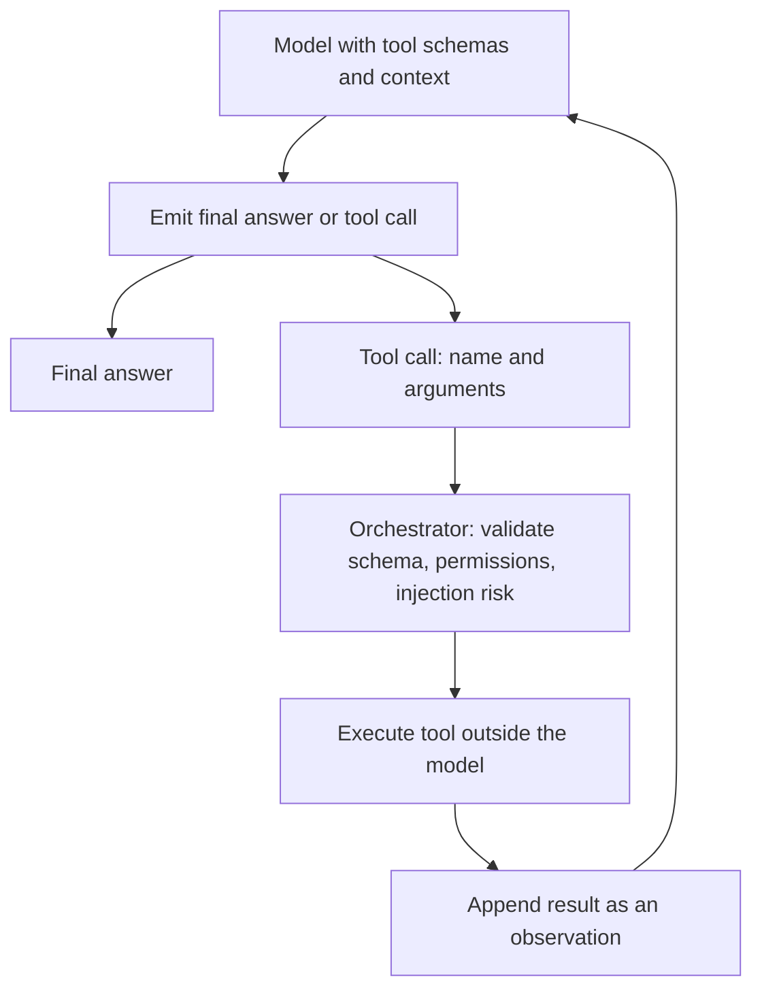

# Tool Use and Function Calling

A language model does not execute tools internally. It emits a structured request, usually a tool name plus JSON arguments. Application code validates the request, checks authorization, executes the tool, and returns the result to the model or user. This is the action layer for [agent loops](agent-loops.md).

## Mechanism

The model sees available [tool schemas](tool-schemas.md), task context, and prior observations. It then generates either a final answer or a tool call. The orchestrator checks schema validity, permissions, idempotency, timeouts, and [prompt injection](prompt-injection.md) risk before execution. [Tool routing](tool-routing.md) can be deterministic, model-selected, or hybrid, but the final execution boundary should remain outside the model.



## Concrete artifact

```json
{
  "model_output": {
    "tool_call": {
      "name": "search_refund_policy",
      "arguments": {
        "query": "enterprise refund threshold",
        "policy_version": "2026-07",
        "top_k": 3
      }
    }
  },
  "orchestrator_checks": {
    "schema_valid": true,
    "user_allowed": true,
    "tool_available": true,
    "side_effect": false
  },
  "tool_result": { "chunk_ids": ["refunds-007", "approvals-014"] }
}
```

The result should be appended as an observation with provenance. It should not silently replace system instructions or grant new permissions.

## Caveats

Side-effecting tools need confirmation and idempotency keys. Tool results are untrusted data unless produced by a trusted internal service and still bounded by policy. A valid JSON call can still be unsafe if the user lacks permission or the retrieved content carries injected instructions.

## References

- [OpenAI API documentation: Function calling](https://platform.openai.com/docs/guides/function-calling)
- [OpenAI API documentation: Using tools](https://platform.openai.com/docs/guides/tools)
- [OpenAI API documentation: Agents SDK](https://platform.openai.com/docs/guides/agents)

> **Section — [Generative AI and Agentic Systems](index.md):** ← [Fine Tuning Versus RAG](fine-tuning-versus-rag.md) · [Tool Schemas](tool-schemas.md) →

> **Learning path — [Generative AI systems](../00-home-and-navigation/learning-paths.md#generative-ai-systems):** ← [RAG](rag.md) · [RAG Evaluation](rag-evaluation.md) →
