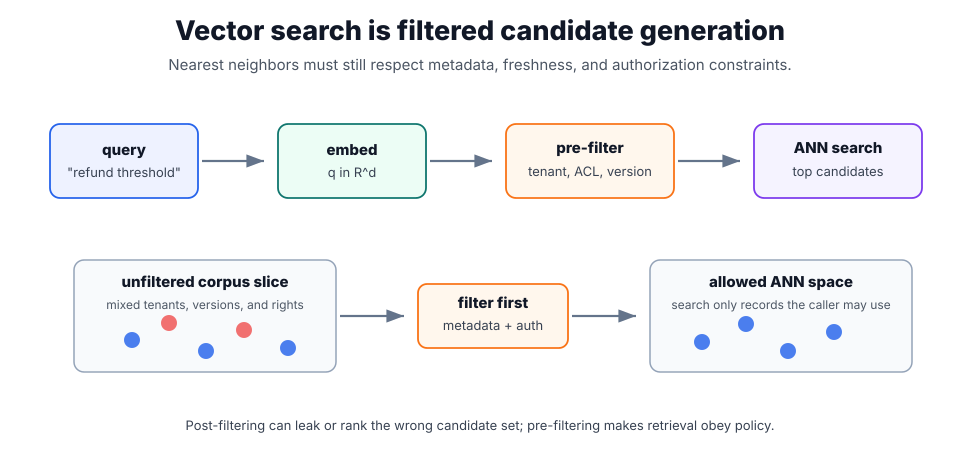

# Vector Databases

Vector databases store [embeddings](embeddings.md) together with document metadata so a query embedding can retrieve semantically nearby records. In [RAG](rag.md), the vector store is not the whole retrieval system; it is one stage between ingestion, filtering, [hybrid retrieval](hybrid-retrieval.md), [reranking](reranking.md), and context packing.

The vector database is responsible for fast candidate generation under metadata constraints. It is not responsible for deciding whether a candidate actually answers the question; that is why retrieval quality must be evaluated across the whole pipeline.

## Nearest-neighbor search

Given normalized corpus vectors $x_i \in \mathbb{R}^d$ and a normalized query vector $q$, cosine search is equivalent to maximizing the dot product:

$$
\operatorname{score}(q,x_i)=q^\top x_i.
$$

Exact search computes that score for every vector. Production systems usually use approximate nearest-neighbor indexes such as HNSW or IVF-style partitioning to trade recall for latency and memory. The query path should apply authorization and freshness filters before unsafe chunks can reach [context construction](context-construction.md); filtering after retrieval can silently drop all useful evidence or expose records before policy checks.



The top row is the normal query path: embed the request, apply metadata and authorization filters, then search the approximate-nearest-neighbor index. The lower row contrasts an unfiltered corpus slice with the allowed search space after filtering. The key point is order: filtering first changes the candidate universe before nearest-neighbor ranking happens.

## Query path

A production query usually does more than "embed and search":

1. Normalize and possibly [rewrite the query](query-rewriting.md).
2. Embed the query with the same embedding family used for the corpus.
3. Apply metadata filters such as tenant, ACL, locale, document type, and version.
4. Search the index for candidate chunks.
5. Merge with lexical or structured results in [hybrid retrieval](hybrid-retrieval.md).
6. [Rerank](reranking.md) a short candidate list.
7. Pack only the selected evidence into model context.

The order matters. If tenant filters are applied after vector search, the nearest neighbors may come from unauthorized documents and then be discarded, leaving weak results. If filters are applied before search, the index searches inside the allowed slice.

## A stored vector record

```json
{
  "id": "policy:refunds:chunk-007",
  "embedding_model": "text-embedding-3-large",
  "embedding_version": "2026-07-10",
  "text_sha256": "7b6f1f...",
  "metadata": {
    "document": "refund_policy",
    "policy_version": "2026-07",
    "acl": ["support", "billing"],
    "valid_from": "2026-07-01"
  }
}
```

This record is useful because it ties the vector to the chunk text, model version, permissions, and policy version. When the corpus is re-embedded, thresholds, cached neighbors, and evaluation baselines should be treated as index-version-specific.

## Index design choices

| Choice            | Trade-off                                                                                                        |
| ----------------- | ---------------------------------------------------------------------------------------------------------------- |
| Embedding model   | controls semantic geometry; changing it invalidates thresholds and neighbor caches.                              |
| Chunk size        | smaller chunks improve pinpoint citation; larger chunks preserve context.                                        |
| ANN index         | HNSW-like graphs favor high recall and low latency; partitioned indexes can reduce memory and speed large scans. |
| Metadata strategy | pre-filtering protects privacy but can reduce recall if metadata is incomplete.                                  |
| Update pattern    | streaming updates improve freshness; batch rebuilds improve consistency.                                         |

For most RAG systems, the important metric is not raw nearest-neighbor recall. It is whether the final packed context contains enough answer-bearing evidence for the model to answer with support.

## Caveats

Nearest neighbor is not the same as answer relevance. Dense retrieval can miss exact identifiers, dates, and rare terms; lexical retrieval can miss paraphrases. Approximate indexes can miss true neighbors, and metadata filters can dominate quality. Embedding-model upgrades can silently change ranking behavior. Evaluate recall before [reranking](reranking.md), after reranking, and after final context packing.

## References

- [Faiss documentation](https://faiss.ai/)
- [OpenAI API documentation: Embeddings](https://platform.openai.com/docs/guides/embeddings)
- [Karpukhin et al., 2020, Dense Passage Retrieval](https://arxiv.org/abs/2004.04906)

> [!nav]
> **Section** — [Generative AI and Agentic Systems](index.md)
>
> [← Chunking](chunking.md) [Retrieval Pipelines →](retrieval-pipelines.md)
