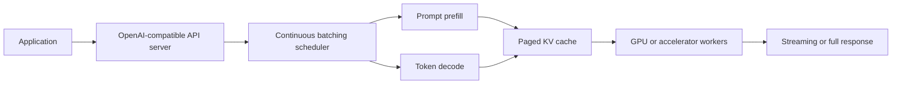

# vLLM

vLLM is an open-source inference and serving engine for self-hosted large language and multimodal models. It is designed to make a GPU-backed model server fast and memory efficient through PagedAttention, continuous batching, optimized attention backends, efficient [KV-cache](kv-cache.md) management, and an OpenAI-compatible HTTP API.

The practical mental model is:

```text
application request -> vLLM scheduler -> batched model execution -> streamed or full response
```

The application still owns routing, permissions, retrieval, prompt construction, validation, observability, and fallbacks. vLLM owns the low-level model execution path.

## Why it exists

Autoregressive language-model serving has two expensive phases:

| Phase   | What happens                                                         | Typical bottleneck                            |
| ------- | -------------------------------------------------------------------- | --------------------------------------------- |
| Prefill | The model processes the prompt and builds attention key-value cache. | Long prompts and repeated context.            |
| Decode  | The model generates one or more output tokens step by step.          | Many concurrent requests and KV-cache memory. |

The [KV cache](kv-cache.md) stores attention keys and values from previous tokens so the model does not recompute the full prefix at every generated token. It can dominate memory during long-context or high-concurrency serving. vLLM's original contribution, PagedAttention, treats KV-cache memory more like paged virtual memory: cache blocks can be allocated and reused more flexibly instead of reserving large contiguous memory per request.

That matters because real traffic has variable prompt lengths, output lengths, and arrival times. A serving engine has to keep the GPU busy without wasting memory on partially filled batches.

## Runtime path



The API server gives callers a familiar HTTP shape. The scheduler decides which active requests can share a batch. The prefill and decode stages use the model runner and attention backend. The paged KV cache lets the runtime pack concurrent sequences into limited accelerator memory more effectively.

## Core ideas

| Idea                          | What it means                                                                                          | Why it matters                                                                                      |
| ----------------------------- | ------------------------------------------------------------------------------------------------------ | --------------------------------------------------------------------------------------------------- |
| PagedAttention                | KV-cache memory is divided into blocks managed by the runtime.                                         | Reduces memory waste from variable-length requests and improves serving throughput.                 |
| Continuous batching           | Requests are batched dynamically as they arrive and generate tokens.                                   | Improves GPU utilization compared with fixed, request-at-a-time execution.                          |
| OpenAI-compatible serving     | vLLM exposes familiar completion, chat, embeddings, and related API shapes depending on model support. | Applications can often switch from hosted APIs or another local server with a small adapter change. |
| Attention backend selection   | vLLM can use optimized backends such as FlashAttention, FlashInfer, or xFormers when compatible.       | Attention kernels heavily affect latency, throughput, and hardware support.                         |
| Prefix caching                | Reused prompt prefixes can be cached.                                                                  | Shared system prompts, templates, or repeated few-shot examples can reduce prefill work.            |
| Quantization and LoRA support | Deployments can use lower-precision weights and adapter modules where supported.                       | Memory footprint and deployment cost can drop, but quality and compatibility still need testing.    |
| Parallelism options           | Larger deployments can use tensor, pipeline, data, or expert parallelism.                              | Very large models or high traffic may exceed one accelerator's capacity.                            |

## Minimal server example

This command starts an OpenAI-compatible server for one model:

```bash
# Start a local vLLM server for this Hugging Face model.
vllm serve Qwen/Qwen2.5-1.5B-Instruct \
  --host 0.0.0.0 \
  --port 8000
```

The model name identifies the model artifact to load. `--host 0.0.0.0` exposes the server on all network interfaces inside the machine or container. `--port 8000` chooses the HTTP port. In production, the server should sit behind the same network, authentication, TLS, logging, and rate-limit controls used for other internal services.

After launch, an application can call the server through an OpenAI-compatible client. The exact request fields still depend on the model's chat template and supported API:

```python
from openai import OpenAI

# The base URL points the OpenAI client at the local vLLM server.
client = OpenAI(api_key="EMPTY", base_url="http://localhost:8000/v1")

# The model string must match the model served by vLLM.
response = client.chat.completions.create(
    model="Qwen/Qwen2.5-1.5B-Instruct",
    messages=[
        {"role": "system", "content": "Answer concisely."},
        {"role": "user", "content": "Explain why KV caching matters."},
    ],
    temperature=0,
)

print(response.choices[0].message.content)
```

The client code does not make the model safe or correct. It only sends a chat-completion request to the local server. Product code still has to validate inputs, control who can call the endpoint, log metadata safely, and check outputs when they feed tools or user-visible decisions.

## Tuning knobs

vLLM exposes many options, but most serving reviews should start with a few questions:

| Knob                   | Question                                                                                      |
| ---------------------- | --------------------------------------------------------------------------------------------- |
| Model and tokenizer    | Which exact model revision and chat template are loaded?                                      |
| Maximum context length | What is the longest prompt plus output length the system accepts?                             |
| Maximum batched tokens | How many prompt and decode tokens can be processed together before memory or latency suffers? |
| Maximum sequences      | How many concurrent requests can be active in one batch?                                      |
| GPU memory utilization | How much accelerator memory may vLLM reserve for model weights and KV cache?                  |
| Quantization           | Which lower-precision format is used, and has quality been evaluated on this task?            |
| Streaming              | Does the product stream partial output, buffer for validation, or both?                       |
| Prefix caching         | Are prompts structured so shared prefixes are actually reusable?                              |
| Observability          | Are latency, queue time, token counts, cache use, errors, and saturation visible?             |

Increasing throughput by batching more requests can also increase tail latency. A good serving configuration is workload-specific: chat, batch summarization, RAG synthesis, coding, embeddings, and agent loops have different prompt lengths, output lengths, and burst patterns.

## vLLM and SGLang

vLLM and [SGLang](sglang.md) live in the same layer: both are self-hosted serving runtimes below the application orchestrator. The difference is emphasis:

| Need                                             | vLLM is often a good fit                                                                      | SGLang is often a good fit                                                         |
| ------------------------------------------------ | --------------------------------------------------------------------------------------------- | ---------------------------------------------------------------------------------- |
| General OpenAI-compatible serving                | Strong default.                                                                               | Also supported, but not the main differentiator.                                   |
| High-throughput standard chat/completion serving | Strong default.                                                                               | Good when workload also uses SGLang's program model.                               |
| Complex structured generation programs           | Possible through API and structured-output features, but application owns more orchestration. | Stronger emphasis on expressing and optimizing structured language-model programs. |
| Shared-prefix or prompt-tree workloads           | Prefix caching helps.                                                                         | RadixAttention is designed around shared-prefix prompt trees.                      |
| Existing application code with direct API calls  | Easy migration through OpenAI-compatible endpoints.                                           | Easy if the API mode is enough; more value if using SGLang program abstractions.   |

This is not a permanent ranking. Serving engines evolve quickly, so a production choice should be benchmarked on the target model, hardware, prompt shape, output length, and traffic pattern.

## When to consider it

Consider vLLM when:

- You want to self-host an open-weight model behind an OpenAI-compatible API.
- The workload is latency- or throughput-sensitive enough to need a real serving engine.
- GPU memory efficiency matters because context windows, concurrency, or model size are large.
- You need continuous batching, streaming, quantization, LoRA adapters, or hardware-specific attention backends.
- You want a standard local serving layer underneath custom application code, [LangChain](langchain.md), [LangGraph](langgraph.md), or a RAG service.

Use a simpler wrapper when traffic is low, the job is offline, startup cost dominates, or a hosted provider already satisfies privacy, latency, quality, and cost requirements.

## Operational caveats

Do not treat an OpenAI-compatible endpoint as a security boundary by itself. Put vLLM behind normal service controls: network isolation, reverse proxy or gateway authentication, TLS, request limits, logging policy, and incident monitoring.

Do not assume deterministic outputs across batching and hardware changes. Kernel choice, batch composition, quantization, model configuration, and floating-point behavior can change outputs. If reproducibility matters, test it explicitly and read it together with [determinism and reproducibility](determinism-and-reproducibility.md).

Do not benchmark only tokens per second. Also measure time-to-first-token, p95 and p99 latency, queue time, request failure rate, memory headroom, output quality, schema failure rate, and cost per successful task.

## References

- [vLLM documentation](https://docs.vllm.cc/en/latest/)
- [vLLM quickstart](https://docs.vllm.cc/en/latest/getting_started/quickstart.html)
- [vLLM GitHub repository](https://github.com/vllm-project/vllm)
- [Kwon et al. 2023, Efficient Memory Management for Large Language Model Serving with PagedAttention](https://arxiv.org/abs/2309.06180)
- [vLLM: Easy, Fast, and Cheap LLM Serving with PagedAttention](https://vllm-project.github.io/2023/06/20/vllm.html)

> [!nav]
> **Section** — [Generative AI and Agentic Systems](index.md)
>
> [← Model Serving](model-serving.md) [SGLang →](sglang.md)
