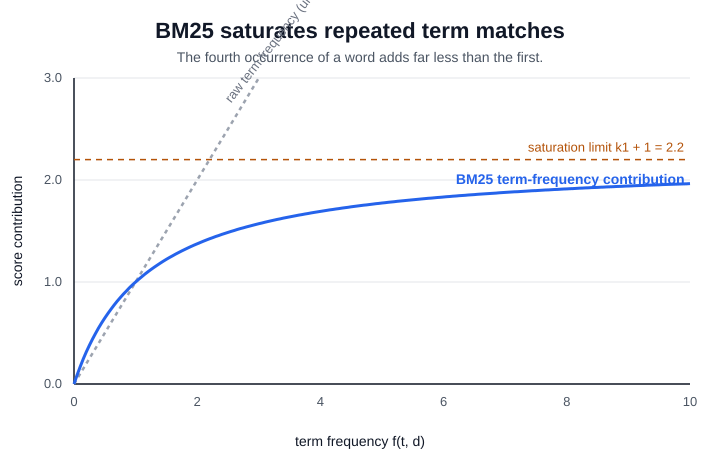

# BM25

BM25 is the default strong baseline for [sparse retrieval](sparse-retrieval.md): it ranks documents by matching query terms, but it does not let one repeated word or one very long document dominate the score. Compared with [TF-IDF](tf-idf.md), BM25 keeps the inverse-document-frequency idea and adds two practical controls: saturating term frequency and length normalization.

## Defining math

For query $q$ and document $d$,

$$
\operatorname{BM25}(q,d)=\sum_{t\in q}\operatorname{IDF}(t)
\frac{f(t,d)(k_1+1)}{f(t,d)+k_1\left(1-b+b\,|d|/\operatorname{avgdl}\right)}.
$$

Here $f(t,d)$ is the term frequency in the document, $|d|$ is document length, and $\operatorname{avgdl}$ is mean document length. A common IDF variant is

$$
\operatorname{IDF}(t)=\log\left(1+\frac{N-n(t)+0.5}{n(t)+0.5}\right),
$$

where $N$ is corpus size and $n(t)$ is the number of documents containing $t$. The parameter $k_1$ controls how quickly repeated occurrences saturate; $b$ controls how strongly long documents are discounted. [Elasticsearch](elasticsearch.md) exposes BM25 with defaults $k_1=1.2$ and $b=0.75$.

The saturation term is what separates BM25 from raw term counting: the first match of a query word contributes a lot, but each additional occurrence contributes less, approaching a ceiling of $k_1+1$. A document that repeats one word a hundred times cannot swamp a document that matches several distinct query terms.



## Worked example

This snippet scores a small corpus with BM25, prints document scores, and returns the ranking for a multi-term query.

```python
import math, re
from collections import Counter
import numpy as np

def tok(s):
    return re.findall(r"[a-z0-9]+", s.lower())

docs = [
    "bm25 lexical search handles exact product codes",
    "dense vector search retrieves semantic paraphrases",
    "hybrid search combines bm25 and dense signals",
]
query = tok("bm25 search dense")
tdocs = [tok(d) for d in docs]
N, avgdl, k1, b = len(docs), sum(map(len, tdocs)) / len(docs), 1.2, 0.75
scores = []
for terms in tdocs:
    tf, dl, score = Counter(terms), len(terms), 0.0
    for term in query:
        df = sum(term in d for d in tdocs)
        idf = math.log(1 + (N - df + 0.5) / (df + 0.5))
        f = tf[term]
        score += idf * (f * (k1 + 1) / (f + k1 * (1 - b + b * dl / avgdl)) if f else 0)
    scores.append(score)
print("avgdl", round(avgdl, 3))
print("scores", [(i + 1, round(s, 3)) for i, s in enumerate(scores)])
print("rank", [int(i + 1) for i in np.argsort(scores)[::-1]])
```

Observed output:

```text
avgdl 6.667
scores [(1, 0.591), (2, 0.629), (3, 1.052)]
rank [3, 2, 1]
```

Document 3 wins because it contains all three query terms. Document 2 beats document 1 because it matches `dense` and `search`, while document 1 matches `bm25` and `search`; the exact numeric gap comes from document frequencies and equal-length normalization.

## Where it fits

BM25 depends on [inverted indexes](inverted-indexes.md) because each query term needs a postings list with document IDs, term frequencies, and often field-length statistics. It is hard to beat on identifiers, names, error codes, and rare technical terms. It is weaker on paraphrase, which is why production systems often combine it with [dense retrieval](dense-retrieval.md) through [hybrid search](hybrid-search.md) or use it as the first stage before [reranking](reranking.md).

## Caveats

BM25 is a bag-of-words model: it does not understand synonymy, word order beyond optional phrase features, or negation. Tuning $k_1$ and $b$ on one query mix can hurt another, especially when fields have very different lengths. Analyzer choices matter as much as the formula; tokenization, stemming, synonyms, and stop-word handling change the postings that BM25 sees.

## References

- [Manning, Raghavan, and Schuetze, Introduction to Information Retrieval: Okapi BM25](https://nlp.stanford.edu/IR-book/html/htmledition/okapi-bm25-a-non-binary-model-1.html)
- [Robertson and Zaragoza, The Probabilistic Relevance Framework: BM25 and Beyond](https://doi.org/10.1561/1500000019)
- [Elasticsearch Reference: Similarity settings](https://www.elastic.co/docs/reference/elasticsearch/index-settings/similarity)

> **Learning path — Information retrieval and search:** ← [Inverted Indexes](inverted-indexes.md) · [path overview](../00-home-and-navigation/learning-paths.md#information-retrieval-and-search) · [Dense Retrieval](dense-retrieval.md) →
