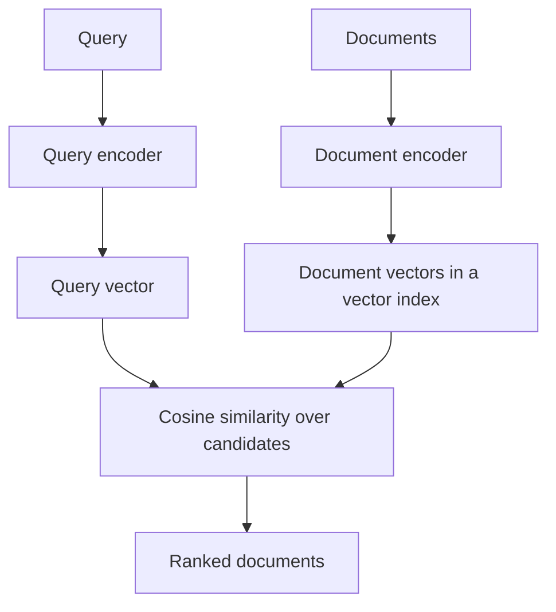

# Dense Retrieval

Dense retrieval embeds queries and documents into continuous vectors, then ranks documents by vector similarity. It is the semantic counterpart to [sparse retrieval](sparse-retrieval.md): exact token overlap is no longer required, but quality depends heavily on the embedding model and training data.

## When to use dense retrieval

Dense retrieval matches on learned meaning rather than exact words, so it complements lexical scoring instead of replacing it:

| Approach                   | Matches on        | Strength                            | Weakness                        |
| -------------------------- | ----------------- | ----------------------------------- | ------------------------------- |
| Lexical ([BM25](bm25.md))  | exact terms       | precise on names, codes, rare terms | misses paraphrases and synonyms |
| Dense (dual-encoder)       | learned semantics | recovers paraphrases and meaning    | can miss exact identifiers      |
| [Hybrid](hybrid-search.md) | both, then fused  | robust across query types           | more moving parts to tune       |

## Dual-encoder scoring

A dual-encoder retriever computes

$$
z_q=f_\theta(q), \qquad z_d=g_\theta(d),
$$

Here $q$ is the query text, $d$ is a document or passage, and $f_\theta,g_\theta$ are the query and document encoders. The resulting vectors $z_q$ and $z_d$ live in the same embedding space so they can be compared quickly.

then scores candidates with dot product or cosine similarity:

$$
s(q,d)=\frac{z_q^\top z_d}{\lVert z_q\rVert_2\lVert z_d\rVert_2}.
$$

The score $s(q,d)$ is high when the two vectors point in a similar direction. Length normalization makes the score a cosine rather than a raw dot product, which reduces the effect of embedding magnitude.

Document vectors can be precomputed and stored in [vector indexes](vector-indexes.md); query vectors are computed at request time. This is cheaper than a cross-encoder [reranking](reranking.md) model because it does not jointly encode every query-document pair.



## Worked example

This snippet builds toy dense embeddings with synonym-like vectors and ranks documents by query-document cosine similarity.

```python
import re
import numpy as np

rng = np.random.default_rng(7)
texts = ["cancel recurring billing", "terminate subscription payments", "bm25 exact token matching"]
query = "cancel subscription"
words = sorted(set(sum([re.findall(r"[a-z0-9]+", x) for x in texts + [query]], [])))
base = {w: rng.normal(size=4) for w in words}
base["terminate"] = base["cancel"] + np.array([0.08, -0.04, 0.03, 0.02])
base["subscription"] = base["billing"] + np.array([0.02, 0.01, -0.03, 0.01])

def emb(text):
    v = sum((base[t] for t in re.findall(r"[a-z0-9]+", text)), np.zeros(4))
    return v / np.linalg.norm(v)

D = np.vstack([emb(t) for t in texts])
scores = D @ emb(query)
print("scores", [(i + 1, round(float(s), 3)) for i, s in enumerate(scores)])
print("rank", [int(i + 1) for i in np.argsort(scores)[::-1]])
```

Observed output:

```text
scores [(1, 0.218), (2, 0.575), (3, 0.182)]
rank [2, 1, 3]
```

The paraphrase document ranks first even though it does not share the token `cancel`. A lexical [BM25](bm25.md) search would need synonyms or query rewriting to make the same jump.

## Caveats

Dense retrieval can blur distinctions that matter: product codes, negation, numbers, dates, and permissions often need lexical or metadata constraints. Embeddings also drift when the corpus or model changes, so reindexing and [search evaluation](search-evaluation.md) need to be part of the release process. In RAG systems, dense recall is only the first step; [hybrid search](hybrid-search.md) and reranking often decide whether the final context is usable.

## References

- [Karpukhin et al., Dense Passage Retrieval for Open-Domain Question Answering](https://arxiv.org/abs/2004.04906)
- [Khattab and Zaharia, ColBERT: Efficient and Effective Passage Search via Contextualized Late Interaction](https://arxiv.org/abs/2004.12832)
- [Elasticsearch Reference: dense_vector field type](https://www.elastic.co/docs/reference/elasticsearch/mapping-reference/dense-vector)

> [!nav]
> **Section** — [Information Retrieval and Search](index.md)
>
> [← Sparse Retrieval](sparse-retrieval.md) [Hybrid Search →](hybrid-search.md)
>
> **Learning path** — [Information retrieval and search](../00-home-and-navigation/learning-paths.md#information-retrieval-and-search)
>
> [← BM25](bm25.md) [Hybrid Search →](hybrid-search.md)
