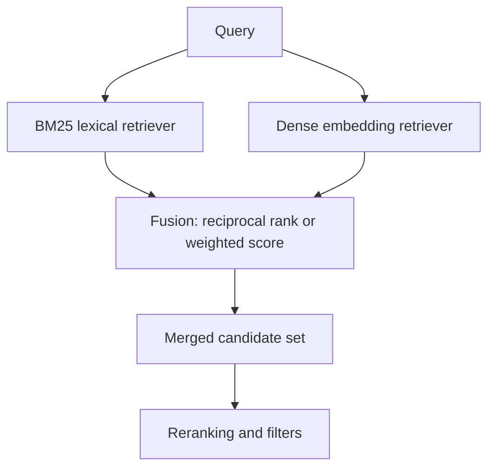

# Hybrid Search

Hybrid search combines result sets from different retrieval signals, most commonly [BM25](bm25.md) and [dense retrieval](dense-retrieval.md). The point is not aesthetic balance: lexical methods catch exact names, IDs, and rare terms, while embeddings catch paraphrase. A good hybrid system keeps both failure modes visible in [search evaluation](search-evaluation.md).

## Reciprocal rank fusion

One common rank-only fusion method is reciprocal rank fusion:

$$
\operatorname{RRF}(d)=\sum_{r\in R}\frac{1}{k+\operatorname{rank}_r(d)}.
$$

Here $R$ is the set of retrievers, and missing documents contribute nothing. Score-based fusion instead normalizes scores and computes a weighted sum, for example

$$
s(d)=\lambda s_{\text{BM25}}(d)+(1-\lambda)s_{\text{dense}}(d).
$$

Here $s(d)$ is the fused score for document $d$, and $\lambda\in[0,1]$ sets the lexical-versus-dense tradeoff. This formula is meaningful only when the component scores are normalized onto compatible scales.

RRF avoids score calibration; weighted sums give more control when a labelled development set is available.



## Worked example

This snippet combines sparse and dense rankings with reciprocal-rank fusion and prints the fused document order.

```python
from collections import defaultdict

bm25_rank = [1, 3, 2]
dense_rank = [2, 3, 1]
scores = defaultdict(float)
for ranklist in [bm25_rank, dense_rank]:
    for rank, doc_id in enumerate(ranklist, start=1):
        scores[doc_id] += 1 / (60 + rank)
print("rrf", [(d, round(s, 5)) for d, s in sorted(scores.items(), key=lambda x: x[1], reverse=True)])
```

Observed output:

```text
rrf [(1, 0.03227), (2, 0.03227), (3, 0.03226)]
```

Documents 1 and 2 tie because each is first in one retriever and third in the other. Document 3 is consistently second, which is almost but not quite enough with this $k$.

## Where it fits

Hybrid retrieval is usually still a candidate-generation stage. The merged set can feed [reranking](reranking.md), metadata filters, diversity rules, or source balancing. In RAG systems it sits near [retrieval pipelines](../11-generative-ai/retrieval-pipelines.md), where [source coverage](../17-experimentation-and-evaluation/coverage.md) and citation quality matter as much as raw relevance.

## Caveats

Fusion can hide regressions: a dense retriever may improve paraphrase queries while hurting exact-code queries, and the aggregate metric may barely move. RRF also has parameters, especially the rank constant and window size. Weighted fusion needs calibrated scores or labelled tuning data; otherwise one score scale can dominate the other.

## References

- [Elasticsearch Reference: Reciprocal rank fusion](https://www.elastic.co/docs/reference/elasticsearch/rest-apis/reciprocal-rank-fusion)
- [Cormack, Clarke, and Buettcher, Reciprocal Rank Fusion Outperforms Condorcet and Individual Rank Learning Methods](https://doi.org/10.1145/1571941.1572114)
- [Bruch, Gai, and Ingber, An Analysis of Fusion Functions for Hybrid Retrieval](https://arxiv.org/abs/2210.11934)

> [!nav]
> **Section** — [Information Retrieval and Search](index.md)
>
> [← Dense Retrieval](dense-retrieval.md) [Reranking →](reranking.md)
>
> **Learning path** — [Information retrieval and search](../00-home-and-navigation/learning-paths.md#information-retrieval-and-search)
>
> [← Dense Retrieval](dense-retrieval.md) [Search Evaluation →](search-evaluation.md)
