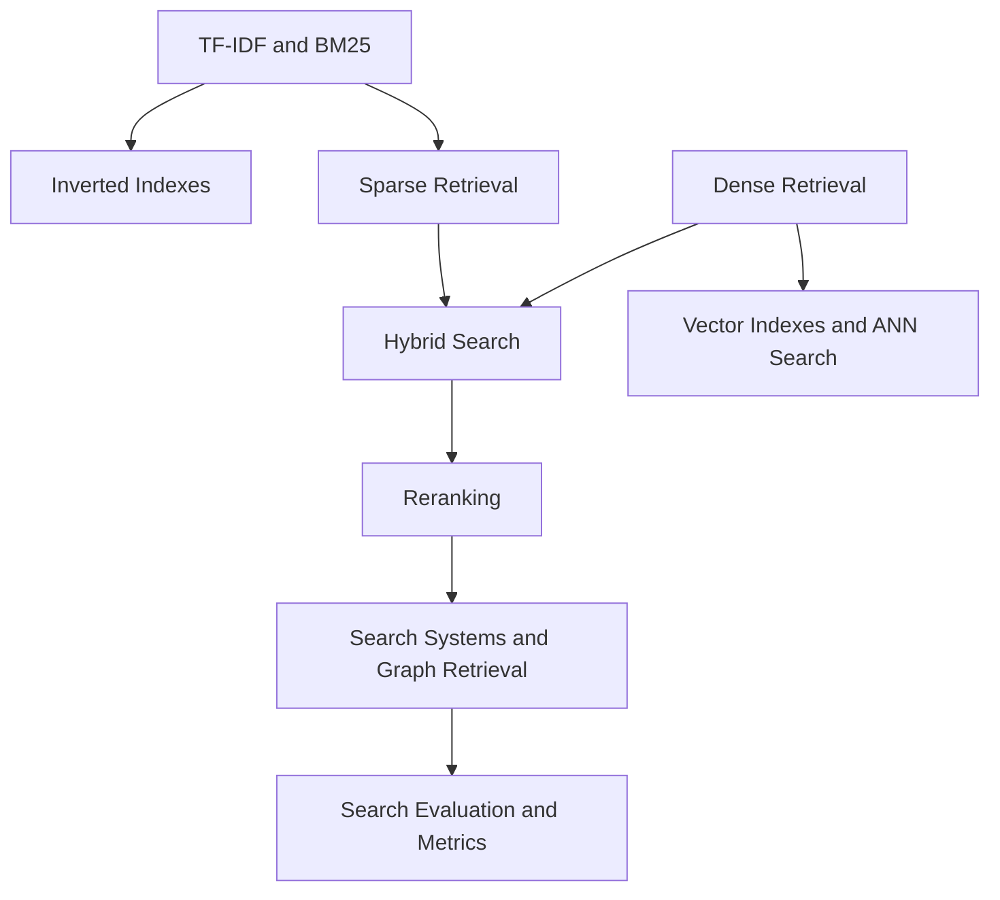

# Information Retrieval and Search

Information retrieval is the engineering and measurement discipline behind finding useful material in a collection. This section moves from lexical indexes and ranking formulas to vector retrieval, hybrid systems, graph retrieval, the systems that host them, and evaluation.

## Knowledge map

Lexical and dense retrieval are the two families; they combine in hybrid search, run on inverted and vector indexes, feed reranking and systems, and are judged by retrieval metrics.

## Reading path

Read lexical retrieval first, then dense and hybrid, indexes and systems, and finally evaluation.

1. [TF-IDF](tf-idf.md): the classic term-weighting baseline.
2. [BM25](bm25.md): the strong lexical ranking function with saturation and length normalization.
3. [Inverted Indexes](inverted-indexes.md): the postings-list structure that makes lexical search fast.
4. [Sparse Retrieval](sparse-retrieval.md): the broader term-feature retrieval family.
5. [Dense Retrieval](dense-retrieval.md): embedding-based semantic retrieval.
6. [Hybrid Search](hybrid-search.md): fusing lexical and dense results.
7. [Reranking](reranking.md): second-stage ordering with richer features or cross-encoders.
8. [Vector Indexes](vector-indexes.md): exact, compressed, and approximate vector search structures.
9. [Approximate Nearest Neighbour Search](approximate-nearest-neighbour-search.md): trading exactness for speed.
10. [Elasticsearch](elasticsearch.md): a widely used Lucene-backed search engine.
11. [ELK Stack](elk-stack.md): Elasticsearch, Logstash, and Kibana together for operational search.
12. [Graph Based Retrieval](graph-based-retrieval.md): retrieval through links, citations, and typed neighborhoods.
13. [Knowledge Graphs](knowledge-graphs.md): structured entity-relationship stores.
14. [Literature Management Search Systems](literature-management-search-systems.md): scholarly search as a worked system.
15. [Search Evaluation](search-evaluation.md): labelled query sets, slices, and online checks.
16. [Ranking and Retrieval Metrics](ranking-and-retrieval-metrics.md): the metric families for ranked lists.
17. [Precision, Recall, MAP, MRR, and NDCG](precision-recall-map-mrr-ndcg.md): the canonical ranking metrics in detail.

## Connections

- [Natural Language Processing](../08-natural-language-processing/index.md) supplies the embeddings and tokenization retrieval relies on.
- [Recommendation Systems](../04-recommendation-systems/index.md) shares candidate generation and ranking, and [Generative AI](../11-generative-ai/index.md) uses this as the retrieval half of RAG.

> [!nav]
> **Learning path** — [Information retrieval and search](../00-home-and-navigation/learning-paths.md#information-retrieval-and-search)
>
> [Inverted Indexes →](inverted-indexes.md)
