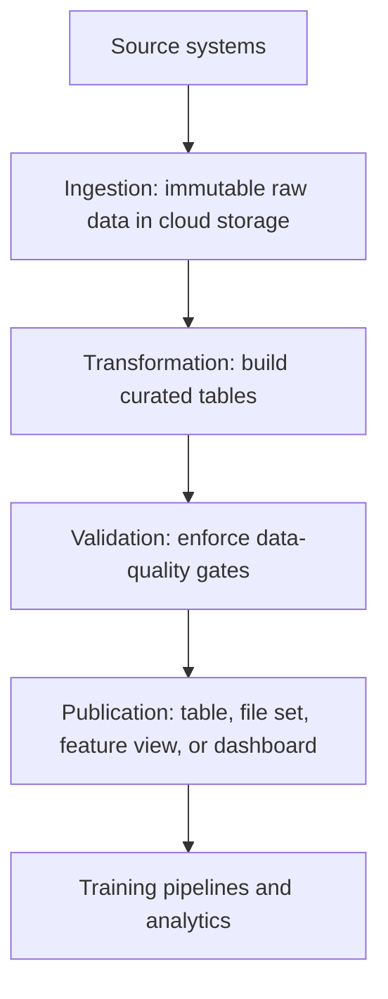

# Data Pipelines

A data pipeline is a repeatable path from source data to a named output dataset. The pipeline contract includes inputs, transformation code, scheduling, quality gates, lineage, and replay behavior. That is broader than [Airflow](airflow.md), which orchestrates tasks, or [dbt](dbt.md), which usually handles warehouse SQL transforms.

## Pipeline contract

The smallest useful pipeline spec names source, transform, target, and watermark. I computed the hash below from the JSON manifest so the run can be compared during an incident or backfill:

```python
import hashlib, json

manifest = {
  "source": "gs://raw/events/date=2026-01-01/*.jsonl",
  "transform": "models/marts/fct_sessions.sql@9f31a2c",
  "target": "warehouse.analytics.fct_sessions",
  "watermark": "2026-01-02T00:00:00Z",
}
print(hashlib.sha256(json.dumps(manifest, sort_keys=True).encode()).hexdigest()[:16])
```

Observed output:

```text
99164d02d2818938
```

That identifier is not a replacement for [data-lineage](data-lineage.md), but it gives operators a concrete handle: this run used exactly this source prefix, code version, target table, and cutoff. [Data-contracts](data-contracts.md) should define whether the source is allowed to add fields, change nullability, or arrive late.

## Architecture

Most pipelines have four boundaries: ingestion writes immutable raw data to [cloud-storage](cloud-storage.md), transformation builds curated tables, validation enforces [data-quality](data-quality.md), and publication exposes a table, file set, feature view, or dashboard source. [ETL and ELT](etl-and-elt.md) changes where transformation happens, not the need for those boundaries.



Pipelines that feed [training pipelines](../14-ml-engineering-and-mlops/training-pipelines.md) need snapshot identifiers and point-in-time semantics; otherwise a later training run can silently see different features from the same nominal date.

## Failure modes

Append-only ingestion without deduplication creates double counting. Watermarks that use processing time instead of event time can drop late business events. A retryable task that writes a partial output without atomic replacement can publish mixed old and new data.

## References

- [Apache Beam Programming Guide](https://beam.apache.org/documentation/programming-guide/)
- [Apache Airflow documentation: DAGs](https://airflow.apache.org/docs/apache-airflow/stable/core-concepts/dags.html)

> **Section — [Data Engineering](index.md):** ← [ETL and ELT](etl-and-elt.md) · [Airflow](airflow.md) →
