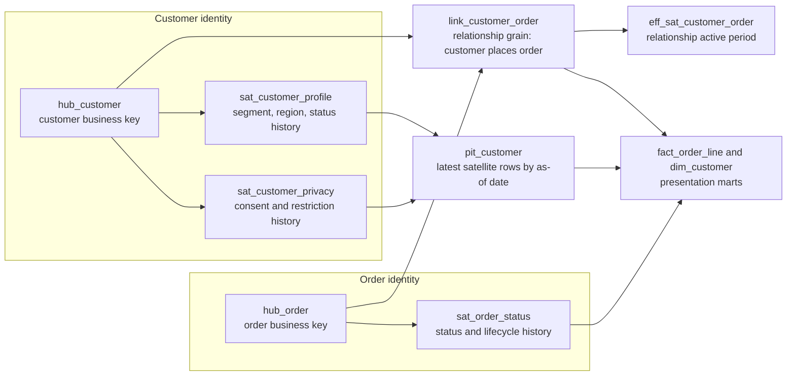

# Data Vault

Data Vault is an enterprise [data warehouse](data-warehouses.md) modelling method for integrating changing source systems while preserving audit history. It is not a dashboard schema. A vault usually sits between raw/staging data and presentation marts: the vault captures business keys, relationships, source metadata, and historical payloads; downstream [dimensional modelling](dimensional-modelling.md) publishes facts, dimensions, and aggregates for analytics.

## Core objects

Data Vault separates stable business identity from relationships and descriptive history.

| Object    | Purpose                                                                                      | Typical columns                                                                               |
| --------- | -------------------------------------------------------------------------------------------- | --------------------------------------------------------------------------------------------- |
| Hub       | One durable business key for a core entity, such as customer, order, product, or account.    | hub hash/surrogate key, business key, load timestamp, record source                           |
| Link      | An association between two or more hubs, such as customer-to-order or product-on-order-line. | link hash/surrogate key, hub keys, load timestamp, record source                              |
| Satellite | Historical descriptive payload attached to one hub or link.                                  | parent key, load timestamp, hashdiff, payload columns, record source, optional effective date |

The hub should not carry mutable attributes such as customer segment or product color. Those values belong in satellites so every change can be loaded as a new historical row. The link should declare relationship grain. If a relationship changes over business time, an effectivity satellite can record start and end dates for that link relationship.



```sql
create table hub_customer (
  customer_hk string not null,
  customer_id string not null,
  load_ts timestamp not null,
  record_source string not null
);

create table link_customer_order (
  customer_order_hk string not null,
  customer_hk string not null,
  order_hk string not null,
  load_ts timestamp not null,
  record_source string not null
);

create table sat_customer_profile (
  customer_hk string not null,
  load_ts timestamp not null,
  hashdiff string not null,
  segment string,
  region string,
  record_source string not null
);
```

This structure stores the customer identity once, the customer-order association once per discovered relationship, and profile changes as an append-only history.

## Design decisions

The first design decision is the business key. A hub key should represent an identity the business recognizes, not an internal pipeline artifact. When multiple source systems use different identifiers for the same real-world entity, the vault needs a clear canonicalization or same-as strategy; otherwise separate hubs will encode duplicates that downstream marts must reconcile repeatedly.

The second decision is relationship grain. A link should describe one kind of association at one grain. A customer-to-order link is different from a household-to-account link or an order-line-to-product link. Mixing those grains makes temporal reasoning and bridge construction ambiguous.

The third decision is satellite splitting. Satellites are usually split by parent object, source, rate of change, privacy boundary, or semantic group. A volatile marketing consent field should not force a slowly changing legal-name satellite to emit a new row on every consent update. A regulated payload can also live in a separate satellite so access control and retention are easier to apply.

Hash keys and hashdiffs are common in distributed warehouses because they make deterministic, parallel loads practical. The hash key identifies a hub or link from its business key inputs; the hashdiff identifies whether a satellite payload changed. The implementation must standardize casing, trimming, null markers, column ordering, and hashing algorithms across every loader.

## Vault layers

A Raw Vault is source-aligned and audit-first. It standardizes technical metadata, hashes, and keys, but avoids applying business rules that would make reconstruction difficult. A Business Vault derives reusable business logic from the Raw Vault: conformed calculations, survivorship choices, same-as mappings, point-in-time tables, bridges, and other query-assistance structures.

The presentation layer should still be fit for consumption. A common flow is:

```text
source extracts -> staging -> raw vault -> business vault -> star-schema marts
```

The Raw Vault answers "what did each source say, and when did we load it?" The Business Vault answers "what reconciled business view do we trust?" The mart answers "what shape can dashboards and analysts query safely?"

## Loading pattern

Vault loading is usually metadata-driven and incremental. A staging model canonicalizes business keys, derives hash keys and hashdiffs, attaches load timestamps and record sources, and feeds standardized hub, link, and satellite loaders. [dbt](dbt.md) or similar SQL tooling can template these repeated patterns.

The rough order is:

1. Load hubs for new business keys.
2. Load links after hub keys are available.
3. Load satellites when the parent hub or link key is known and the hashdiff indicates a new payload state.
4. Build Business Vault helpers such as point-in-time and bridge tables for repeated temporal joins.
5. Project dimensional marts from the vault for reporting and downstream [feature-pipelines](feature-pipelines.md).

This shape supports parallelism because hubs, independent links, and satellites can often be loaded without row-by-row procedural logic.

## Querying history

Raw Vault tables are intentionally verbose for analytical queries. A query that wants the customer profile as of an order date may need the customer hub, one or more customer satellites, the customer-order link, link effectivity, and date filters on load or business-effective timestamps. That pattern is correct for audit, but unpleasant for dashboards.

Business Vault helpers make those joins repeatable. A point-in-time table precomputes the latest applicable satellite row for each hub at selected as-of dates. A bridge table precomputes traversals across links, such as customer to household to account. Effectivity satellites record the active period of a relationship when link membership itself changes over business time. These objects are not substitutes for facts and dimensions; they are acceleration and semantics layers that make mart projection tractable.

The final consumer model should still declare a grain. For example, a `fact_order_line` table can be projected from order, product, customer, and pricing vault objects, while `dim_customer` is assembled from the applicable customer satellites and business survivorship rules.

## Comparison

Compared with normalized [relational-modelling](relational-modelling.md), Data Vault is more explicit about source history, load metadata, and separating relationships from descriptive attributes. A third-normal-form warehouse may model customers, orders, and products cleanly, but it often requires additional conventions to capture multi-source history and late-arriving changes.

Compared with a [star schema](dimensional-modelling.md#star-schema), Data Vault optimizes integration and auditability rather than direct analytics. A star schema keeps query paths short and metrics understandable, but it denormalizes context into dimensions and facts. A vault keeps the historical integration layer flexible, then lets teams publish multiple marts from the same governed history.

| Question         | Data Vault answer                                     | Star-schema answer                            |
| ---------------- | ----------------------------------------------------- | --------------------------------------------- |
| Primary goal     | Integrate sources with traceable history.             | Serve analytics at a declared grain.          |
| Core objects     | Hubs, links, satellites, PITs, bridges.               | Facts, dimensions, aggregates.                |
| Change handling  | Append new satellite rows and preserve record source. | Slowly changing dimensions or fact snapshots. |
| Query ergonomics | Requires projection or helper tables.                 | Designed for BI and analyst queries.          |
| Best layer       | Integration and history layer.                        | Presentation and consumption layer.           |

## When to use it

Data Vault is useful when an organization has many source systems, evolving schemas, strict audit needs, or a long-lived enterprise warehouse where business keys and relationships matter more than any single reporting use case. It is especially attractive when the team can automate pattern generation and treat model metadata as code.

It is usually too heavy for a small single-source warehouse, a narrow product analytics mart, or a team that needs fast BI delivery without capacity to maintain the vault and mart layers. In those cases, staged ELT plus reviewed dimensional marts may be enough.

## Automation

Modern Data Vault work is rarely hand-written table by table. Teams normally describe sources, business keys, satellite payloads, and relationship mappings in metadata, then generate dbt models, SQL templates, tests, and lineage. Automation is not a convenience detail: without it, repeated hub/link/satellite boilerplate becomes error-prone and the model becomes too expensive to evolve.

Useful generated tests include uniqueness on hub business keys, non-null hash keys, valid parent keys for links and satellites, duplicate hashdiff detection, load timestamp monotonicity checks, and freshness checks by record source. Those tests connect Data Vault modelling to [data quality](data-quality.md), [data contracts](data-contracts.md), and [data lineage](data-lineage.md).

## Failure modes

Data Vault fails when every source column becomes a model object without a business key decision. Weak key canonicalization creates duplicate hubs. Links with vague grain create relationship explosions. Satellites become hard to use when they are split by accident rather than by source, rate of change, or privacy boundary. Raw Vault models become brittle when business rules are applied too early. Business Vault helpers become stale if point-in-time and bridge tables are not rebuilt consistently with the underlying satellites.

The practical rule is: vault the integration history, not the report. Publish marts for consumers, and keep lineage from mart columns back to the vault objects that generated them.

## References

- [AutomateDV documentation: What is Data Vault 2.0?](https://automate-dv.readthedocs.io/en/latest/#what-is-data-vault-20)
- [AutomateDV documentation: Hubs](https://automate-dv.readthedocs.io/en/latest/tutorial/tut_hubs/)
- [AutomateDV documentation: Links](https://automate-dv.readthedocs.io/en/latest/tutorial/tut_links/)
- [AutomateDV documentation: Satellites](https://automate-dv.readthedocs.io/en/latest/tutorial/tut_satellites/)
- [AutomateDV documentation: Effectivity Satellites](https://automate-dv.readthedocs.io/en/latest/tutorial/tut_eff_satellites/)
- [AutomateDV documentation: As of Date Tables](https://automate-dv.readthedocs.io/en/latest/tutorial/tut_as_of_date/)

> [!nav]
> **Section** — [Data Engineering](index.md)
>
> [← Data Warehouses](data-warehouses.md) [Distributed Warehouse Modelling →](distributed-warehouse-modelling.md)
