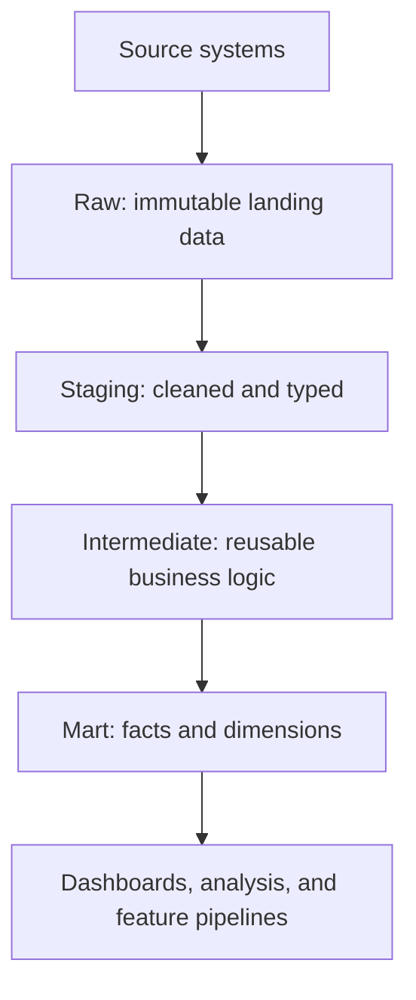

# Data Warehouses

A data warehouse stores integrated, historical, queryable data for analytics. Its core promise is not "large tables"; it is consistent semantics: the same order, customer, and revenue definition should support dashboards, analysis, and downstream [feature-pipelines](feature-pipelines.md).

## Warehouse mechanism

Warehouses separate raw landing data from curated analytical models. A common flow is raw orders -> cleaned staging -> facts and dimensions from [dimensional-modelling](dimensional-modelling.md). The mart layer is where business definitions live: the aggregate below turns raw orders into daily revenue, and that metric means what it means only because the query restricts to `status = 'paid'` before grouping by day.

```sql
WITH raw_orders(order_id, customer_id, order_ts, status, amount) AS (
  VALUES
    (1, 10, '2026-01-01T09:00:00', 'paid', 50),
    (2, 10, '2026-01-01T10:00:00', 'refunded', 20),
    (3, 11, '2026-01-02T09:00:00', 'paid', 80),
    (4, 12, '2026-01-02T12:00:00', 'paid', 40)
)
SELECT
  substr(order_ts, 1, 10) AS order_date,
  count(*) AS paid_orders,
  sum(amount) AS gross_revenue
FROM raw_orders
WHERE status = 'paid'
GROUP BY 1
ORDER BY 1;
```

Result:

```text
order_date    paid_orders  gross_revenue
2026-01-01    1            50
2026-01-02    2            120
```

The metric is only meaningful because the query encodes a status filter. In production that logic should live in reviewed [SQL](sql.md) or [dbt](dbt.md) models, not in each dashboard.

## Architecture

Warehouse layers usually separate `raw`, `staging`, `intermediate`, and `mart` schemas. [ETL and ELT](etl-and-elt.md) determines whether transforms run before or after loading, but modern cloud warehouses typically favor ELT because storage is cheap and SQL engines scale independently. [Data Vault](data-vault.md) is one way to model the historical integration layer before publishing marts. [Distributed warehouse modelling](distributed-warehouse-modelling.md) separates the logical mart grain from the physical layout needed for partition pruning, clustering, and repeated query patterns. [Vendor solutions](vendor-solutions.md) such as Snowflake, Databricks, BigQuery, Redshift, and Fabric choose different boundaries for storage, compute, governance, and AI workloads.



## Failure modes

Warehouses fail when multiple marts define the same metric differently, when raw data is overwritten before audits finish, and when access controls expose row-level sensitive data through broad analytical tables.

## References

- [BigQuery documentation: Introduction to partitioned tables](https://cloud.google.com/bigquery/docs/partitioned-tables)
- [dbt documentation: SQL models](https://docs.getdbt.com/docs/build/sql-models)

> [!nav]
> **Section** — [Data Engineering](index.md)
>
> [← Dimensional Modelling](dimensional-modelling.md) [Data Vault →](data-vault.md)
