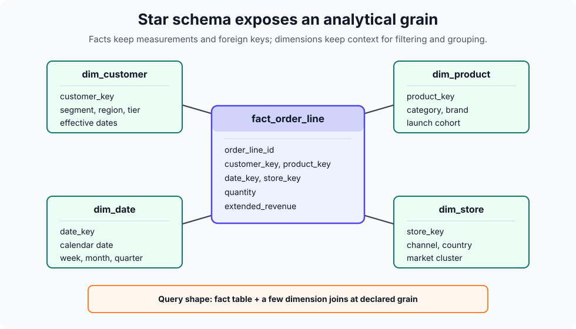
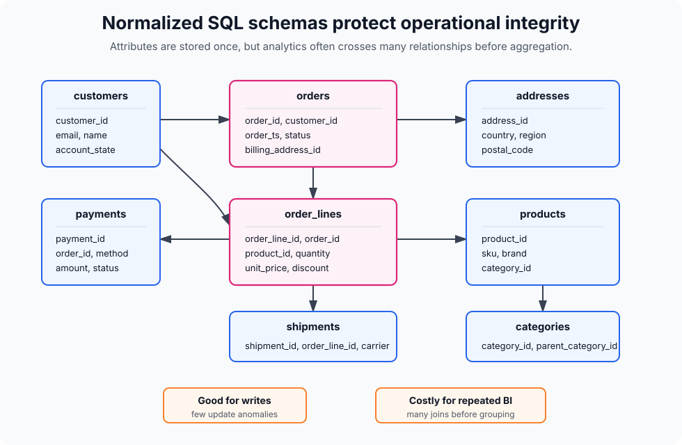

# Distributed Warehouse Modelling

Distributed warehouse modelling separates two decisions that are easy to confuse: the logical contract of the data and the physical layout used to query it cheaply. The logical contract declares grain, keys, dimensions, facts, and metric definitions. The physical layout chooses partitions, clustering, file sizes, materialized summaries, and incremental rebuild boundaries for a distributed [data-warehouse](data-warehouses.md) or lakehouse.

## Logical model

A [star schema](dimensional-modelling.md#star-schema) remains the usual presentation model for analytics because it gives readers a central fact table at one declared grain and dimensions that hold labels, hierarchies, and slowly changing context. A sales mart might have `fact_order_line` joined to `dim_customer`, `dim_product`, `dim_store`, and `dim_date`; the fact owns additive measures such as quantity and extended revenue, while the dimensions own filters and group labels.



Traditional enterprise warehouse designs often keep an integrated normalized core before publishing marts. A third-normal-form warehouse emphasizes entity integrity and avoids repeated attributes. A [Data Vault](data-vault.md) core separates stable business keys, relationships, and historical attributes into hubs, links, and satellites. Those patterns are useful for integration and audit, but they are usually not the most ergonomic shape for BI users. Modern systems commonly keep raw or silver layers source-shaped or normalized, then publish [dimensional-modelling](dimensional-modelling.md) stars, wide tables, or aggregate marts for consumption.



The design question is therefore not "[star schema](dimensional-modelling.md#star-schema) or normalized warehouse?" It is which layer owns which responsibility:

- Raw and staging layers preserve source history and replayability.
- Integrated layers reconcile keys, deduplicate records, and retain audit history.
- Mart layers expose business-conformed facts, dimensions, and measures.
- Aggregate layers accelerate repeated expensive questions without replacing atomic facts.

## Physical layout

At small scale, a clean logical model may be enough. At very large scale, the same model succeeds only if common queries read a small fraction of distributed storage. Modern columnar engines use metadata to skip data: partition pruning skips date or range slices, clustering and data skipping co-locate common filter values, and micro-partition metadata lets engines avoid row groups whose min/max values cannot match the predicate.

For a large order-line fact, a useful physical contract might be:

```sql
create table mart.fact_order_line
(
  order_line_id string not null,
  order_id string not null,
  customer_key int64 not null,
  product_key int64 not null,
  order_ts timestamp not null,
  order_date date not null,
  quantity int64 not null,
  extended_revenue numeric not null,
  order_status string not null
)
partition by order_date
cluster by customer_key, product_key, order_status;
```

The logical grain is still one row per order line. The partition key follows the dominant time filter and backfill boundary. Clustering keys follow selective filters and joins that appear in real workloads. In a different warehouse, the syntax may be Snowflake clustering, Databricks liquid clustering, Delta Z-ordering, or Iceberg hidden partitioning. [Vendor solutions](vendor-solutions.md) package these choices differently, but the design intent is the same: make the physical layout match the query workload without changing the business grain.

## Query patterns

Large distributed warehouses reward predictable access patterns:

- Filter on partition columns whenever the business question has a time or range boundary.
- Select only needed columns so columnar scans avoid irrelevant data.
- Join large facts to small dimensions using declared keys and stable dimension grain.
- Pre-aggregate large facts before joining if the downstream question does not need row-level detail.
- Materialize repeated expensive transformations, joins, or summaries instead of rebuilding them in every dashboard query.
- Keep atomic facts available even when summary tables exist, so analysts can drill down and correct aggregates when requirements change.

[dbt](dbt.md) often owns these contracts in SQL: staging models clean source fields, intermediate models encode reusable joins, marts publish facts and dimensions, and incremental models rebuild only new or affected partitions. [Data-quality](data-quality.md) checks should assert fact grain, dimension uniqueness, allowed nulls, and accepted status values before downstream dashboards depend on them.

## Failure modes

Distributed warehouses fail when logical and physical design drift apart. A vague fact grain causes double counting no matter how scalable the engine is. Over-normalized marts make BI queries join many large tables repeatedly. Over-wide tables hide metric definitions and can make every dashboard scan expensive columns. Tiny partitions create metadata overhead; huge partitions prevent pruning. Clustering on unused columns burns maintenance work without saving scans. Too many materialized summaries create conflicting metric definitions unless ownership and lineage are explicit.

## References

- [Kimball Group: Fact Tables](https://www.kimballgroup.com/2008/11/fact-tables/)
- [Kimball Group: The 10 Essential Rules of Dimensional Modeling](https://www.kimballgroup.com/2009/05/the-10-essential-rules-of-dimensional-modeling/)
- [BigQuery documentation: Introduction to partitioned tables](https://cloud.google.com/bigquery/docs/partitioned-tables)
- [BigQuery documentation: Optimize query computation](https://cloud.google.com/bigquery/docs/best-practices-performance-compute)
- [Snowflake documentation: Micro-partitions and Data Clustering](https://docs.snowflake.com/en/user-guide/tables-clustering-micropartitions)
- [Databricks documentation: Use liquid clustering for tables](https://docs.databricks.com/aws/en/tables/clustering)
- [Apache Iceberg documentation: Partitioning](https://iceberg.apache.org/docs/latest/partitioning/)
- [Databricks documentation: Medallion lakehouse architecture](https://docs.databricks.com/aws/en/lakehouse/medallion)

> [!nav]
> **Section** — [Data Engineering](index.md)
>
> [← Data Vault](data-vault.md) [Vendor Solutions →](vendor-solutions.md)
