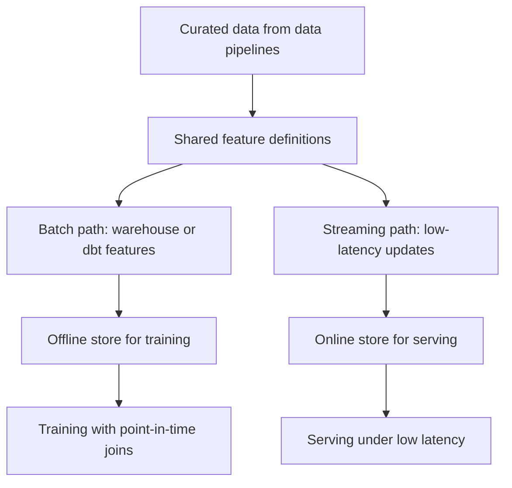

# Feature Pipelines

Feature pipelines compute model inputs from operational or analytical data. Their special contract is point-in-time correctness: training features must include only information available before the label or prediction timestamp, while serving features must use the same definitions under lower latency.

## Point-in-time mechanism

This SQL example shows the leakage boundary. The transaction at `2026-01-10T02:00:00` happens after the label timestamp and must not be included:

```sql
WITH labels(entity_id, label_ts) AS (
  VALUES (7, '2026-01-10T00:00:00')
),
transactions(entity_id, event_ts, amount) AS (
  VALUES
    (7, '2026-01-08T12:00:00', 30),
    (7, '2026-01-09T20:00:00', 40),
    (7, '2026-01-10T02:00:00', 999)
)
SELECT
  l.entity_id,
  sum(t.amount) AS spend_before_label
FROM labels l
LEFT JOIN transactions t
  ON t.entity_id = l.entity_id
 AND t.event_ts < l.label_ts
GROUP BY l.entity_id;
```

Result:

```text
entity_id  spend_before_label
7          70
```

The query joins transactions only when `event_ts < label_ts`, so the feature is $30+40=70$. The later transaction for `999` is excluded because it occurs two hours after the label timestamp; without the timestamp predicate, the feature would be $30+40+999=1069$ and would leak future behavior into training.

## Architecture

Feature pipelines sit between [data-pipelines](data-pipelines.md) and [training-pipelines](../14-ml-engineering-and-mlops/training-pipelines.md). Batch features can be built in a warehouse with [dbt](dbt.md) or SQL; low-latency features may require streaming updates from [batch-versus-streaming](batch-versus-streaming.md) systems into an online store. [Dataset-versioning](../14-ml-engineering-and-mlops/dataset-versioning.md), [data-lineage](data-lineage.md), and [data-quality](data-quality.md) checks must travel with the training dataset.

The same feature definitions must feed both paths; when the offline and online paths diverge, the result is training-serving skew.



## Failure modes

Training-serving skew appears when offline SQL uses a different join, window, or fill value than online serving code. Backfills can rewrite historical features unless snapshot identifiers are pinned. Aggregations over late events need explicit watermark behavior, not accidental dependence on ingestion order.

## References

- [Feast documentation: Feature view](https://docs.feast.dev/getting-started/concepts/feature-view)
- [Apache Beam Programming Guide](https://beam.apache.org/documentation/programming-guide/)

> [!nav]
> **Section** — [Data Engineering](index.md)
>
> [← Reproducibility](reproducibility.md)
