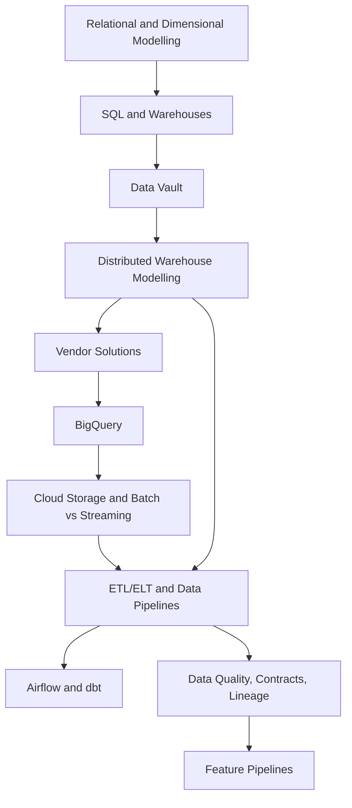

# Data Engineering

Data engineering builds reliable paths from source events and operational records to analytical tables, features, and governed datasets. The useful through-line is contract first: what is the grain, who owns it, how is it tested, and can it be rebuilt?

## Knowledge map

Data modelling and SQL underpin warehouses; vaults, distributed layout, and vendor platforms turn warehouse models into scalable, auditable query surfaces; storage and processing choices feed pipelines and orchestration; governance and feature pipelines sit on top.

## Reading path

Read modelling and SQL, then storage and pipelines, orchestration, governance, and feature pipelines.

1. [Relational Modelling](relational-modelling.md): keys, constraints, and table relationships that protect integrity.
2. [SQL](sql.md): joins, aggregation, and window functions as the core transformation language.
3. [Dimensional Modelling](dimensional-modelling.md): facts, dimensions, grain, and slowly changing context.
4. [Data Warehouses](data-warehouses.md): curated analytical stores for shared metrics.
5. [Data Vault](data-vault.md): hubs, links, satellites, and auditable enterprise integration history.
6. [Distributed Warehouse Modelling](distributed-warehouse-modelling.md): star schemas, normalized cores, and physical layout for large analytical systems.
7. [Vendor Solutions](vendor-solutions.md): Snowflake, Databricks, BigQuery, Redshift, Fabric, and adjacent platform tools.
8. [BigQuery](bigquery.md): managed warehouse design with partitioning and clustering.
9. [Cloud Storage](cloud-storage.md): object layout for raw, staged, curated, and versioned assets.
10. [Batch Versus Streaming](batch-versus-streaming.md): bounded and unbounded processing trade-offs.
11. [ETL and ELT](etl-and-elt.md): where extraction, loading, and transformation happen.
12. [Data Pipelines](data-pipelines.md): production dataflows with sources, transforms, targets, and watermarks.
13. [Airflow](airflow.md): orchestration for scheduled, observable task graphs.
14. [dbt](dbt.md): versioned SQL models, tests, and warehouse dependency graphs.
15. [Data Quality](data-quality.md): executable checks that block or warn on invalid data.
16. [Data Contracts](data-contracts.md): producer-consumer agreements for schema, semantics, and ownership.
17. [Data Lineage](data-lineage.md): job and dataset graph metadata for impact analysis.
18. [Reproducibility](reproducibility.md): pinned inputs, code, parameters, and output snapshots.
19. [Feature Pipelines](feature-pipelines.md): point-in-time model features for training and serving.

## Connections

- [Software Engineering](../16-software-engineering/index.md) supplies the testing and design discipline pipelines need.
- [ML Engineering and MLOps](../14-ml-engineering-and-mlops/index.md) consumes feature pipelines, and [Cloud and Distributed Systems](../15-cloud-and-distributed-systems/index.md) runs the processing.
