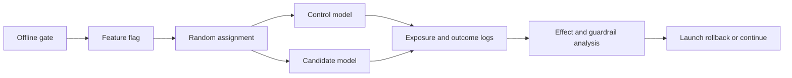

# MLOps A-B Testing

A-B testing compares model or product variants by randomly assigning eligible units to a control arm and a treatment arm. In MLOps, it answers a different question than [evaluation datasets](evaluation-datasets.md): after the candidate model passed offline gates and reached production traffic, did it improve the live outcome without violating guardrails?

The control arm, usually called $A$, serves the current production behavior. The treatment arm, usually called $B$, serves the candidate model, feature pipeline, prompt, ranking policy, or threshold. The random assignment makes the two groups comparable before exposure, so a difference in outcomes can be interpreted as evidence about the release rather than as a difference between user populations. The experimentation section has the canonical planning page on [A-B testing](../17-experimentation-and-evaluation/a-b-testing.md), while [hypothesis testing](../02-probability-and-statistics/hypothesis-testing.md) owns the z-statistic mechanics. This page focuses on release mechanics, observability, and model-governance decisions.

## Release experiment contract

An MLOps A-B test should start as a release contract, not as an ad hoc dashboard comparison. The contract must state the unit of randomization, assignment key, exposure rule, primary metric, guardrails, exclusion rules, ramp plan, stopping rule, owner, and rollback path. It should also record the model version, feature version, data contracts, serving configuration, and metric definitions in [experiment tracking](experiment-tracking.md), because a live experiment result is only useful if the exact shipped system can be reconstructed.

A practical release walkthrough is:

1. Pass offline gates on fixed [evaluation datasets](evaluation-datasets.md), including slice checks and regression tests.
2. Deploy the candidate behind a feature flag or routing rule, with versioned telemetry and a rollback target.
3. Randomly assign eligible units to $A$ or $B$ using a stable assignment key such as user ID, account ID, session ID, or cluster ID.
4. Log assignment before exposure, then log exposure only when the user could actually experience the variant.
5. Measure the primary outcome and guardrails from the same pre-specified event definitions.
6. Check assignment integrity, sample-ratio mismatch, missing events, and version drift before computing the effect.
7. Decide: continue, ramp, rollback, or run longer according to the pre-written rule.

The diagram separates two jobs that are often confused. [Canary deployment](canary-deployment.md) protects reliability by sending a small amount of traffic to the candidate. A-B testing estimates impact by preserving randomized comparison between arms. A release may use both: canary first for safety, then A-B testing for causal evidence.

## Two-rate release check

Many release experiments use a binary primary metric: clicked or not, converted or not, escalated or not, accepted or not. Let $n_A$ and $n_B$ be the exposed units and $x_A$ and $x_B$ the successes in control and treatment, so the observed rates are $\hat p_A=x_A/n_A$ and $\hat p_B=x_B/n_B$ and the absolute lift is $\hat\Delta=\hat p_B-\hat p_A$, measured in probability points.

To judge whether $\hat\Delta$ is larger than the noise expected from random assignment, apply the two-proportion z-test derived in [hypothesis testing](../02-probability-and-statistics/hypothesis-testing.md): under the null both arms share the pooled rate $\hat p=(x_A+x_B)/(n_A+n_B)$, and the lift is standardized by its null standard error,

$$
z=\frac{\hat p_B-\hat p_A}{SE_0},\qquad SE_0=\sqrt{\hat p(1-\hat p)\left(\tfrac{1}{n_A}+\tfrac{1}{n_B}\right)}.
$$

A large positive $z$ favors treatment; a large negative $z$ favors control. Sample-size and power planning for this test is the job of the [A-B testing](../17-experimentation-and-evaluation/a-b-testing.md) page, while [confidence intervals](../02-probability-and-statistics/confidence-intervals.md), repeated looks, and interference belong to [online experiments](../17-experimentation-and-evaluation/online-experiments.md).

## Worked example

Suppose a support-routing model has passed offline checks and the team now tests whether a new ranking model increases the binary outcome "user accepts the suggested route." This is a live production A-B test with user-level randomization: the control arm $A$ serves the current model, and the treatment arm $B$ serves the candidate. After two weeks the logged exposures and acceptances are:

| arm       |  users | conversions |   rate |
| --------- | -----: | ----------: | -----: |
| control   | 12,000 |         984 | 0.0820 |
| treatment | 11,850 |       1,055 | 0.0890 |

so $n_A=12{,}000$, $x_A=984$, $n_B=11{,}850$, and $x_B=1{,}055$. Work through the check one step at a time.

**Step 1 — observed rates.** Each arm's acceptance rate is its successes divided by its exposed users, the natural estimate of that arm's true acceptance probability:

$$
\hat p_A=\frac{984}{12{,}000}=0.0820, \qquad \hat p_B=\frac{1{,}055}{11{,}850}=0.0890
$$

**Step 2 — observed lift.** The release cares about the difference in rates:

$$
\hat\Delta=\hat p_B-\hat p_A=0.0890-0.0820=0.0070,
$$

a 0.70 percentage-point increase. On its own this is not enough: a gap this size can appear from random assignment even if the two models are identical, so it must be compared against the sampling noise.

**Step 3 — pooled rate under the null.** The null hypothesis is that both arms have the same true acceptance probability. Under that assumption the best estimate of the single shared rate combines all successes over all users:

$$
\hat p=\frac{984+1{,}055}{12{,}000+11{,}850}=0.0855
$$

Pooling is what makes the next quantity a _null_ standard error: it deliberately ignores the observed gap and asks what the noise would look like if the arms were truly equal.

**Step 4 — null standard error of the lift.** $SE_0$ is the standard deviation of $\hat\Delta$ expected from random assignment alone when the null holds:

$$
SE_0=\sqrt{0.0855\,(0.9145)\left(\tfrac{1}{12{,}000}+\tfrac{1}{11{,}850}\right)}=0.00362
$$

So even with no real effect, the measured lift would typically wobble by about 0.36 percentage points just from who landed in which arm.

**Step 5 — z-statistic.** The z-statistic re-expresses the lift in units of that noise — how many null standard errors it sits from zero:

$$
z=\frac{\hat\Delta}{SE_0}=\frac{0.00703}{0.00362}=1.94
$$

**Step 6 — p-value.** For a two-sided test the p-value is the null probability of a $|z|$ at least this large, read from the standard normal distribution $\Phi$:

$$
p=2\bigl(1-\Phi(1.94)\bigr)=0.052
$$

If the two models were truly equal, a lift this extreme in either direction would occur about 5.2 percent of the time — which narrowly misses a conventional $\alpha=0.05$ two-sided threshold.

**Step 7 — confidence interval.** Inverting the same normal approximation gives a range of lifts compatible with the data, $\hat\Delta\pm 1.96\,SE$, using the estimated standard error (which for these near-equal rates is $\approx SE_0$):

$$
0.00703 \pm 1.96\,(0.00362)=[-0.0001,\ 0.0141]
$$

The interval straddles zero, so the data are still compatible with essentially no lift and with a lift of about 1.4 percentage points. The p-value and the interval tell the same story: the effect is promising but not yet conclusive.

**Step 8 — the release decision.** This is where MLOps differs from a pure statistics exercise. Even a clearly significant lift is not sufficient for launch. The decision should also check [monitoring](monitoring.md) guardrails: latency, error rate, fallback rate, complaint rate, cost, and protected or high-risk slices. If treatment improves conversion but increases p95 latency, routes more users to manual review, or causes [model degradation](model-degradation.md) in a sensitive segment, the correct decision may be to hold, ramp more slowly, or roll back despite a promising primary metric.

## History and adoption

Randomized controlled experiments come from statistics and clinical trials, but large-scale web experimentation made them an everyday engineering tool. Search engines, marketplaces, recommender systems, and advertising platforms adopted online controlled experiments because offline metrics could not reliably predict user behavior under ranking changes, feedback loops, and production latency. Modern ML platforms now treat A-B testing as part of the release lifecycle: offline evaluation filters candidates, canaries protect reliability, randomized experiments estimate impact, and monitoring watches for delayed regressions after launch.

In ML systems, the adoption pressure is especially strong because model changes are often behavior changes without obvious code diffs. A new feature pipeline, retrained model, threshold, prompt, or retrieval policy can change exposure, user trust, support load, and data collected for the next model. A-B testing gives teams a disciplined way to separate "the candidate looked better offline" from "the shipped system made production outcomes better."

## Caveats

Peeking, assignment drift, sample-ratio mismatch, interference, and mid-test model changes can invalidate the result. Recommenders and marketplaces may need switchback or cluster designs, covered more broadly in [online experiments](../17-experimentation-and-evaluation/online-experiments.md).

Do not randomize by request when users can appear many times and learn from previous exposures; use a stable user, account, device, or cluster key that matches the decision. Do not exclude "bad" events after looking at treatment behavior unless the exclusion was pre-specified. Do not retrain, change prompts, alter thresholds, or migrate feature definitions mid-test without treating that as a new variant. A statistically significant lift is not sufficient for launch when guardrails, legal constraints, or operational ownership fail.

## References

- [Larsen et al., Statistical Challenges in Online Controlled Experiments](https://arxiv.org/abs/2212.11366)
- [Kohavi, Henne, and Sommerfield, Practical Guide to Controlled Experiments on the Web](https://doi.org/10.1145/1454008.1454027)
- [Kohavi, Longbotham, Sommerfield, and Henne, Controlled Experiments on the Web](https://doi.org/10.1007/s10618-008-0114-1)
- [Google Rules of Machine Learning](https://developers.google.com/machine-learning/guides/rules-of-ml)

> [!nav]
> **Section** — [ML Engineering and MLOps](index.md)
>
> [← Rollbacks](rollbacks.md) [Monitoring →](monitoring.md)
