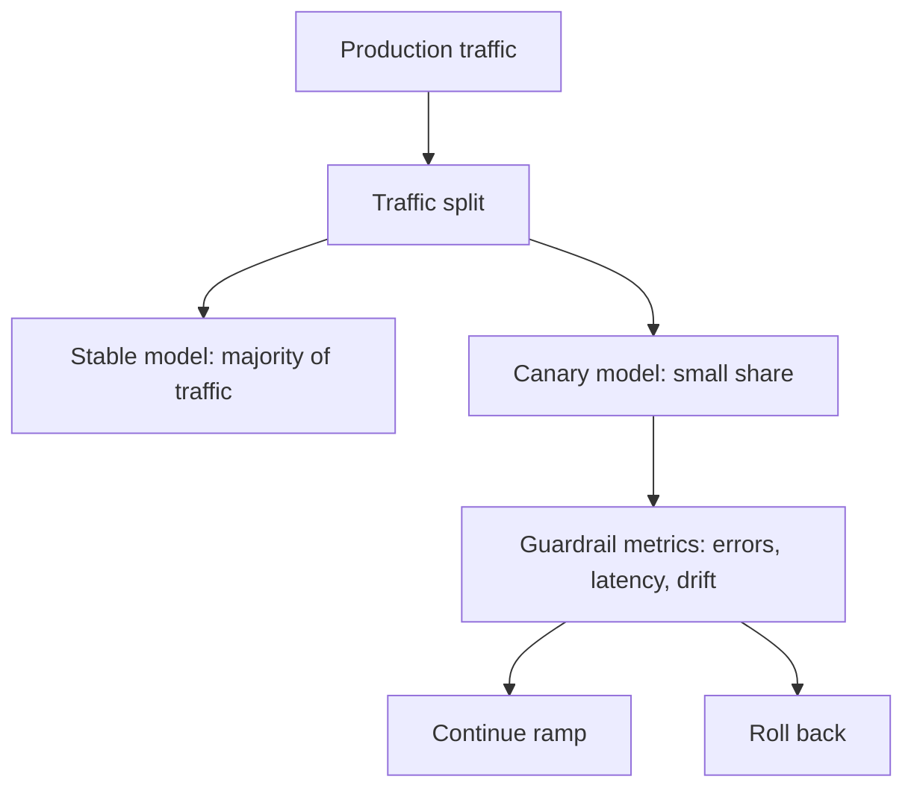

# Canary Deployment

A canary deployment routes a small, controlled share of production traffic to a new [model-serving](model-serving.md) version before full release. It reduces blast radius while exposing the candidate to real request shapes, dependencies, and latency pressure.

## Mechanism

Canaries need three contracts: traffic assignment, guardrail metrics, and rollback triggers. Traffic can be random, sticky by user, regional, or feature-flagged. Guardrails should include service health, score distribution, fallback rate, and delayed product or label outcomes. The first decision is usually "continue ramp or [roll back](rollbacks.md)," not "declare the model better."



## Worked Guardrail

Suppose the baseline path sees 37 errors in 50,000 requests and the canary path sees 9 errors in 5,000 requests:

| path     | requests | errors | error rate |
| -------- | -------: | -----: | ---------: |
| baseline |   50,000 |     37 |    0.00074 |
| canary   |    5,000 |      9 |    0.00180 |

The canary error rate is more than twice the baseline rate. A one-sided normal approximation gives $z=1.733$ and $p=0.0416$, so at a 5% one-sided guardrail this canary is high enough to stop the ramp. A real rollout would also check [service-level objectives](service-level-objectives.md), segment mix, and output drift in [monitoring](monitoring.md).

## Artifact: Progressive Rollout

```yaml
strategy:
  canary:
    steps:
      - setWeight: 5
      - pause: { duration: 30m }
      - analysis:
          templates: [fraud-error-rate, p95-latency]
      - setWeight: 25
      - pause: { duration: 2h }
```

## Failure Modes

A canary misses harm when the sample excludes the risky segment, assignment is not sticky, or delayed labels arrive after the ramp. Run a [shadow deployment](shadow-deployment.md) first when integration risk is higher than user-impact risk.

## References

- [Argo Rollouts: Canary](https://argo-rollouts.readthedocs.io/en/stable/features/canary/)
- [Kubernetes Deployments](https://kubernetes.io/docs/concepts/workloads/controllers/deployment/)

> **Section — [ML Engineering and MLOps](index.md):** ← [Shadow Deployment](shadow-deployment.md) · [Rollbacks](rollbacks.md) →
