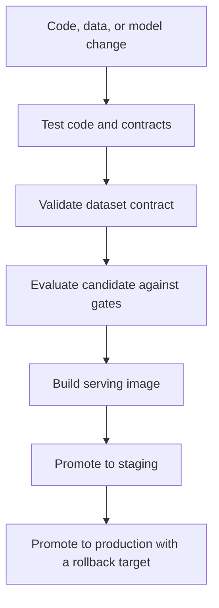

# CI/CD for ML

CI/CD for ML extends ordinary software delivery with checks for data contracts, training reproducibility, model quality, serving compatibility, and rollback metadata. A green unit-test suite is not enough to promote a model that was trained on the wrong snapshot.

## Mechanism

The pipeline should separately test code, data, model artifact, and deployment contract. Continuous integration blocks broken changes; continuous delivery promotes an approved [model-versioning](model-versioning.md) record through staging and production using [docker](docker.md) images and rollout controls.



## Artifact: Promotion Workflow

```yaml
name: ml-release
on:
  pull_request:
  workflow_dispatch:
jobs:
  validate:
    runs-on: ubuntu-latest
    steps:
      - uses: actions/checkout@v4
      - run: python -m pytest tests/unit tests/contracts
      - run: python scripts/check_dataset_contract.py --dataset churn_eval:v7
      - run: python scripts/evaluate_candidate.py --min-auc 0.84 --max-p95-ms 120
      - run: docker build -t registry.example.com/churn-scorer:${{ github.sha }} .
```

This workflow references [evaluation datasets](evaluation-datasets.md) and produces evidence that [experiment tracking](experiment-tracking.md) should store with the candidate run. Promotion should fail closed when dataset versions, thresholds, or serving schemas are missing.

## Failure Modes

CI/CD becomes theater when it retrains on mutable tables, treats aggregate accuracy as the only gate, or deploys without a [rollbacks](rollbacks.md) target. Human approval is still useful for risky changes, but it should review concrete evidence, not notebook screenshots.

## References

- [GitHub Actions workflow syntax](https://docs.github.com/en/actions/reference/workflows-and-actions/workflow-syntax)
- [Google Cloud: MLOps continuous delivery and automation pipelines](https://cloud.google.com/architecture/mlops-continuous-delivery-and-automation-pipelines-in-machine-learning)

> **Section — [ML Engineering and MLOps](index.md):** ← [Training Pipelines](training-pipelines.md) · [Experiment Tracking](experiment-tracking.md) →
