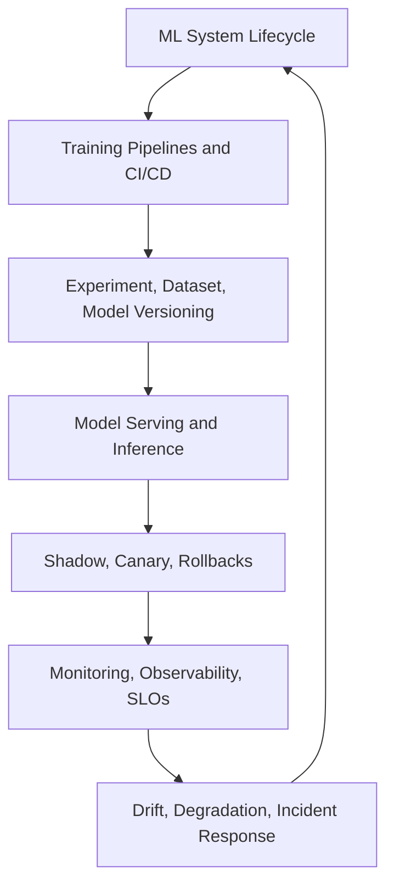

# ML Engineering and MLOps

ML engineering and MLOps covers the lifecycle around a model: versioned data, reproducible training, evaluation gates, deployment, monitoring, reliability, and incident response. The model is only one artifact. A production ML system also includes datasets, feature definitions, pipelines, serving contracts, dashboards, rollback paths, and ownership.

Use this section when the question is "how do we operate this model safely and repeatedly?" For infrastructure primitives, see [Cloud and Distributed Systems](../15-cloud-and-distributed-systems/index.md); for experiment design and release evidence, see [Experimentation and Evaluation](../17-experimentation-and-evaluation/index.md).

## Knowledge map

The lifecycle runs from training and versioning through serving, staged release, operation, and drift response, then loops back when monitoring finds new evidence.

## Reading path

Read the lifecycle and training first, then artifacts, serving, release, operation, and drift.

1. [ML System Lifecycle](ml-system-lifecycle.md): the end-to-end path from framing to retirement.
2. [Training Pipelines](training-pipelines.md): automated, auditable model production.
3. [CI/CD for ML](ci-cd-for-ml.md): tests and promotion gates for code, data, and models.
4. [Experiment Tracking](experiment-tracking.md): recording the evidence behind runs.
5. [Dataset Versioning](dataset-versioning.md): immutable, referenceable training data.
6. [Model Versioning](model-versioning.md): registering and promoting model artifacts.
7. [Evaluation Datasets](evaluation-datasets.md): the held-out sets that gate release.
8. [Golden Datasets](golden-datasets.md): curated regression sets for critical behavior.
9. [Model Serving](model-serving.md): the runtime layer for reliable inference.
10. [Batch and Online Inference](batch-and-online-inference.md): scheduled versus request-time scoring.
11. [Microservices](microservices.md): decomposing the prediction path into services.
12. [Docker](docker.md): reproducible deployment units.
13. [Shadow Deployment](shadow-deployment.md): testing on copied traffic without exposure.
14. [Canary Deployment](canary-deployment.md): progressive exposure with guardrails.
15. [Rollbacks](rollbacks.md): reverting safely when a release goes wrong.
16. [A/B Testing](a-b-testing.md): controlled comparison of model variants.
17. [Monitoring](monitoring.md): tracking health and quality in production.
18. [Observability](observability.md): traces and logs that explain behavior.
19. [Service Level Objectives](service-level-objectives.md): the reliability targets to hold.
20. [Reliability](reliability.md): timeouts, retries, and graceful degradation.
21. [Data Drift](data-drift.md): input distributions moving away from training.
22. [Concept Drift](concept-drift.md): the input-output relationship changing.
23. [Model Degradation](model-degradation.md): quality decay without label change.
24. [Production Incident Response](production-incident-response.md): handling model incidents.
25. [Human-in-the-Loop Systems](human-in-the-loop-systems.md): routing uncertain cases to people.
26. [Active Learning](active-learning.md): choosing which examples to label next.

## Connections

- [Data Engineering](../13-data-engineering/index.md) supplies the pipelines and features these systems consume.
- [Cloud and Distributed Systems](../15-cloud-and-distributed-systems/index.md) runs the infrastructure, and [Responsible AI](../18-responsible-ai-safety-and-governance/index.md) governs deployed behavior.
