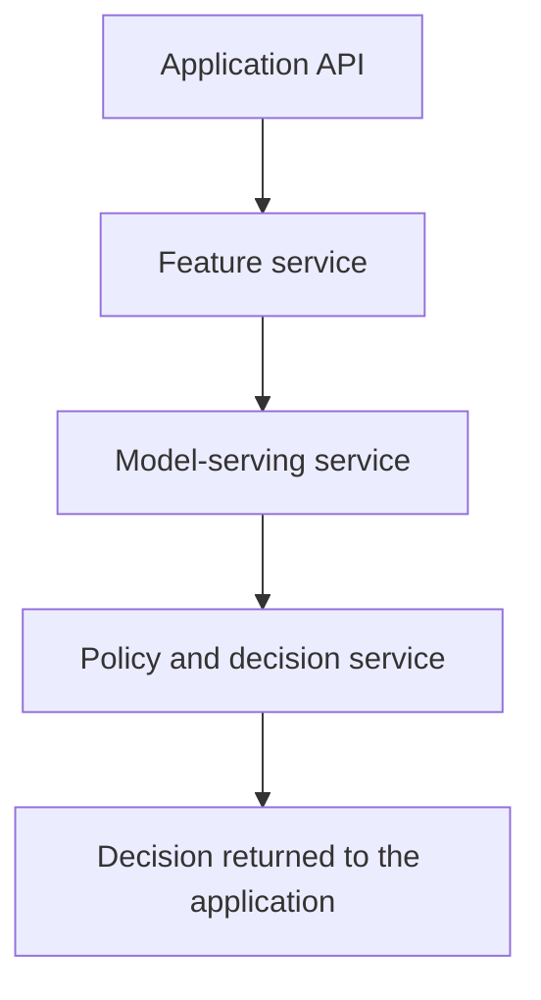

# Microservices

In ML systems, microservices split responsibilities such as feature retrieval, model scoring, policy decisions, and feedback collection into independently deployable services. The pattern helps when ownership and scaling boundaries are real; it hurts when a single prediction path becomes a chain of poorly observed network calls.

## Mechanism

Each service owns an API contract, deployment unit, telemetry, and failure policy. A typical synchronous decision path is application API -> feature service -> [model-serving](model-serving.md) service -> policy service. A slow dependency can consume the whole user-facing latency budget, so [reliability](reliability.md) depends on timeouts, bulkheads, retries with limits, and fallbacks.



## Artifact: Service Boundary Sketch

```yaml
services:
  feature-service:
    endpoint: GET /v1/features/{entity_id}
    timeout_ms: 40
    owns: [freshness, schema_validation]
  fraud-scorer:
    endpoint: POST /v1/fraud:score
    timeout_ms: 90
    owns: [model_version, inference_latency, score_distribution]
  decision-policy:
    endpoint: POST /v1/fraud:decide
    timeout_ms: 30
    owns: [thresholds, manual_review_rules, audit_reason_codes]
trace_context: required
```

The trace context requirement connects directly to [observability](observability.md): an operator should be able to follow one transaction across all services and see the model and feature versions involved. Docker images make the deployment unit portable, but [docker](docker.md) does not remove the need for API compatibility.

## Failure Modes

Microservices amplify schema drift and partial outages. If the feature service changes a field from seconds to milliseconds, the scorer can remain healthy while decisions become wrong. If retries stack across services, a traffic spike can become self-inflicted overload. Keep the number of services justified by ownership and failure isolation, not architecture fashion.

## References

- [Kubernetes Services](https://kubernetes.io/docs/concepts/services-networking/service/)
- [OpenTelemetry Signals](https://opentelemetry.io/docs/concepts/signals/)

> **Section — [ML Engineering and MLOps](index.md):** ← [Batch and Online Inference](batch-and-online-inference.md) · [Docker](docker.md) →
