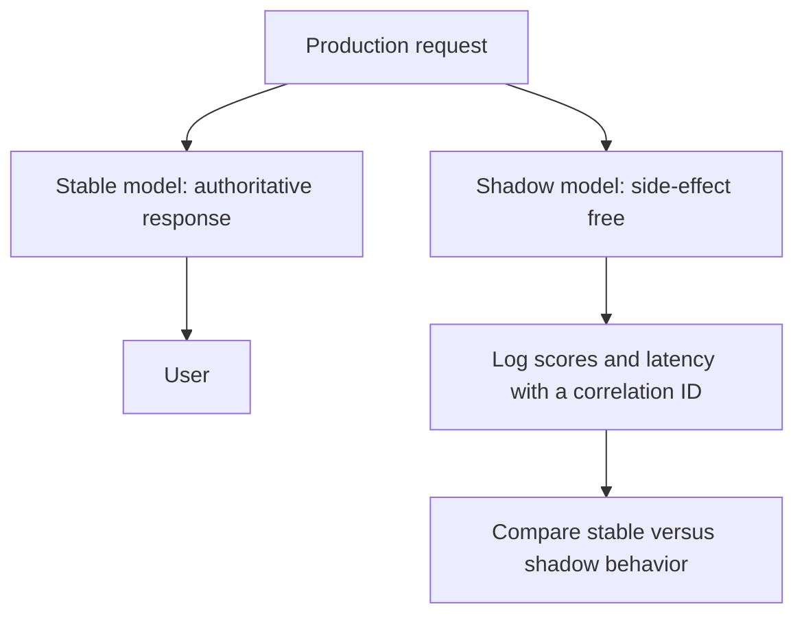

# Shadow Deployment

A shadow deployment sends production requests to the current service and copies the same requests to a candidate model whose response is logged but not shown to users. It tests [model-serving](model-serving.md) integration, latency, resource use, and output distributions before a [canary deployment](canary-deployment.md) exposes users.

## Side-effect-free shadowing

The stable path remains authoritative. The shadow path must be side-effect free: no emails, charges, database writes, recommendation impressions, or policy actions. Every copied request should carry the same correlation ID so [observability](observability.md) can compare stable and shadow behavior.



## Artifact: Shadow Routing Policy

```yaml
endpoint: fraud-score-prod
production_variant:
  name: stable-v41
  initial_weight: 1.0
shadow_variants:
  - name: candidate-v42
    sampling_percentage: 20
    capture:
      fields: [request_id, model_version, score, latency_ms, error]
      destination: s3://ml-observability/fraud-shadow/2026-07-11/
side_effect_policy:
  allow_writes: false
  allow_external_calls: false
```

The useful comparison is not only "did it crash?" but "where do scores differ and why?" Pair shadow logs with [monitoring](monitoring.md) dashboards for latency, timeout rate, output quantiles, and missing-feature errors.

## Limits

Shadowing cannot estimate user reaction because users never see the candidate output. It also cannot detect policies triggered only after exposure, such as feedback loops in recommenders. When shadow results look safe, the next step is a limited canary with explicit [rollbacks](rollbacks.md).

## References

- [Amazon SageMaker: Testing models with shadow variants](https://docs.aws.amazon.com/sagemaker/latest/dg/model-shadow-deployment.html)
- [OpenTelemetry Signals](https://opentelemetry.io/docs/concepts/signals/)

> [!nav]
> **Section** — [ML Engineering and MLOps](index.md)
>
> [← Docker](docker.md) [Canary Deployment →](canary-deployment.md)
