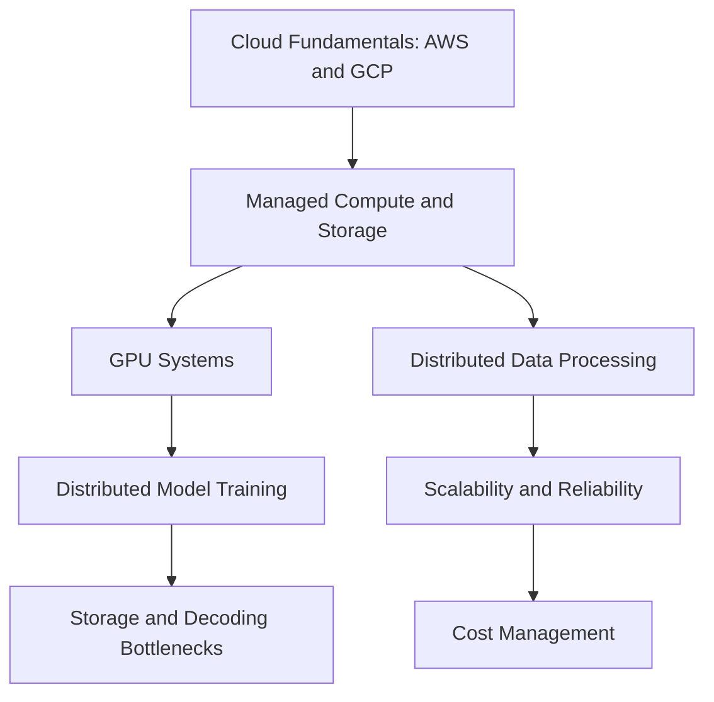

# Cloud and Distributed Systems

Cloud and distributed systems covers the infrastructure layer that makes data and ML systems usable at scale: managed compute, storage, accelerators, distributed processing, reliability, and cost control. The recurring trade-off is locality versus elasticity: cloud services make capacity easy to obtain, but network boundaries, storage formats, accelerator memory, and operational failure modes decide whether a design is actually fast, reliable, and affordable.

Use this section when a model or data pipeline stops being a notebook problem and becomes a system problem. Pair it with [ML Engineering and MLOps](../14-ml-engineering-and-mlops/index.md) for deployment and [Data Engineering](../13-data-engineering/index.md) for data layout.

## Knowledge map

Cloud fundamentals and managed services underpin GPU and distributed workloads; scalability, reliability, and cost sit on top of everything.

## Reading path

Read cloud fundamentals, then managed services and accelerators, distributed workloads, and finally scalability, reliability, and cost.

1. [AWS Fundamentals](aws-fundamentals.md): core AWS primitives and identity.
2. [Google Cloud Fundamentals](google-cloud-fundamentals.md): the equivalent GCP building blocks.
3. [Managed Compute](managed-compute.md): serverless, containers, and managed clusters.
4. [Managed Storage](managed-storage.md): object, block, and warehouse storage services.
5. [GPU Systems](gpu-systems.md): accelerator memory, throughput, and scheduling.
6. [Distributed Data Processing](distributed-data-processing.md): partitioning, shuffles, and hot keys.
7. [Distributed Model Training](distributed-model-training.md): data and model parallelism.
8. [Storage and Decoding Bottlenecks](storage-and-decoding-bottlenecks.md): keeping accelerators fed.
9. [Scalability](scalability.md): scaling out under load without cost blowups.
10. [Reliability](reliability.md): failure isolation, retries, and redundancy.
11. [Cost Management](cost-management.md): controlling and attributing production spend.

## Connections

- [Software Engineering](../16-software-engineering/index.md) provides the service-design discipline these systems assume.
- [Data Engineering](../13-data-engineering/index.md) and [ML Engineering and MLOps](../14-ml-engineering-and-mlops/index.md) run their workloads on this infrastructure.
