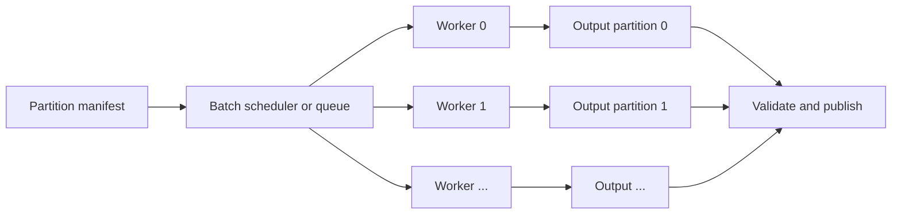

# Partitioning for Parallel Execution

Partitioning for parallel execution means splitting one large workload into smaller, mostly independent units so multiple cloud workers can process them at the same time. It is the practical pattern behind many sharded scripts, batch jobs, backfills, simulation runs, offline evaluations, and embarrassingly parallel data-processing tasks.

The key idea is simple:

```text
partition input -> run one task per partition -> write partition outputs -> combine or publish
```

The first step defines disjoint units of work. The second step lets cloud workers process those units concurrently. The third step keeps every worker's result separate until validation proves that all expected partitions finished.

This page focuses on finite script and batch workloads. The related [distributed data processing](distributed-data-processing.md) page covers full distributed engines such as Spark or Beam, where shuffles, joins, and hot keys become central.

## Partitioning versus sharding

Partitioning is the general idea of splitting data or work into pieces. Sharding is a common form of partitioning where a stable key decides which piece owns a record. In casual cloud work the terms often overlap, but the distinction helps when designing a job:

| Term      | Meaning                                                            | Example                                                                        |
| --------- | ------------------------------------------------------------------ | ------------------------------------------------------------------------------ |
| Partition | Any bounded slice of the workload.                                 | Process one date, file prefix, tenant, image folder, or simulation seed range. |
| Shard     | A key-assigned partition, often intended to be stable across runs. | Worker `7` processes records where `hash(user_id) % 100 == 7`.                 |
| Batch     | A finite set of work processed on a schedule or request.           | Nightly scoring for all active accounts.                                       |
| Task      | One executable unit assigned to a worker.                          | Container started with `--shard-id 7 --num-shards 100`.                        |

Table partitions, SQL window partitions, and workload partitions are related but not identical. A warehouse table may be partitioned by date for scan pruning; a script may also use date as its work partition, but that is an execution choice rather than a table semantics choice.

## Cloud pattern



The manifest names every unit of work before execution starts. That can be a list of object-storage prefixes, date intervals, primary-key ranges, tenant IDs, or shard IDs. The scheduler then launches workers with partition-specific parameters. Each worker writes to its own output location first; a final validation step checks completeness before downstream systems read the result.

This design is common with managed batch services, Kubernetes Jobs, Airflow dynamic task mapping, serverless functions, and containerized scripts launched from a queue. [Managed compute](managed-compute.md) chooses where the workers run; partitioning chooses what each worker owns.

## Worked example

Suppose a script enriches 120 million event records by calling a local model and writing one Parquet file per partition. A sequential script would take about 20 hours. Instead, create 200 shards:

```text
# Every run records the total number of shards.
num_shards = 200

# The scheduler starts one worker for each shard ID.
shard_id in {0, 1, ..., 199}

# Each worker keeps only records assigned to its shard.
process record if hash(user_id) % num_shards == shard_id

# Each worker writes to a shard-specific output path.
write output to gs://curated/events_enriched/run=2026-09-15/shard=shard_id/
```

A worker receives `shard_id` and `num_shards`, filters the input deterministically, processes only its records, and writes only to its shard output path. If 200 workers run in parallel and the workload is balanced, wall-clock time can fall from many hours to minutes plus startup, read, write, and validation overhead.

The deterministic hash rule matters. If worker 17 crashes, the scheduler can rerun shard 17 without rerunning the whole job. If the output path is partition-specific, the retry can replace only `shard=17` after staging or atomic commit. That makes the job much easier to reason about than 200 workers appending to the same file or table.

## Deterministic shard assignment

A common shard rule is

$$
s(r) = H(k(r)) \bmod N,
$$

where:

| Symbol  | Meaning                                                                                                   |
| ------- | --------------------------------------------------------------------------------------------------------- |
| $r$     | One input record, file, user, document, event, or simulation job.                                         |
| $k(r)$  | The stable partitioning key extracted from record $r$, such as `user_id`, `account_id`, or `document_id`. |
| $H$     | A deterministic hash function that maps the key to an integer.                                            |
| $N$     | The total number of shards or workers in the run.                                                         |
| $s(r)$  | The shard ID assigned to record $r$, between $0$ and $N-1$.                                               |
| $\bmod$ | The remainder operation; it folds the hash value into one of $N$ shard IDs.                               |

Worker $j$ processes exactly the records for which $s(r)=j$. This creates non-overlapping work as long as every worker uses the same $H$, $k$, and $N$.

Changing $N$ changes many assignments, so the shard count should be recorded in the run manifest. If a job needs stable ownership over time, use a table of explicit ranges or consistent hashing rather than casually changing `num_shards` between runs.

## Common partitioning strategies

| Strategy               | Good fit                                          | Main risk                                                            |
| ---------------------- | ------------------------------------------------- | -------------------------------------------------------------------- |
| File or object prefix  | Large file sets already stored in object storage. | Tiny files create scheduling and listing overhead.                   |
| Date or time range     | Backfills, reporting partitions, event logs.      | Recent dates may be much larger or less complete than old dates.     |
| Key range              | Numeric IDs with known distribution.              | Sparse or skewed ID ranges create uneven workers.                    |
| Hash of stable key     | Users, accounts, items, documents, traces.        | Harder to inspect manually; changing shard count changes assignment. |
| Tenant or customer     | Multi-tenant systems with ownership boundaries.   | Large tenants dominate runtime unless split further.                 |
| Explicit manifest rows | Heterogeneous jobs with custom metadata.          | Manifest generation becomes part of correctness.                     |

Good partitioning balances worker time, makes retries local, and keeps outputs unambiguous. It should also match the natural correctness boundary: if downstream consumers publish daily reports, date partitions are often easier to validate than arbitrary hash shards.

## What can go wrong

Partitioning accelerates work only when partitions are independent enough. Shared mutable state can turn a parallel job into a race condition. Common failures include:

- **Skew:** one partition has far more rows, larger files, or slower records than the rest.
- **Overlapping work:** two workers process the same record because the partition predicate is not exclusive.
- **Missing work:** a manifest omits a date, prefix, or shard.
- **Non-idempotent side effects:** retries send duplicate emails, charge customers twice, or double-write rows.
- **Shared output races:** many workers append to the same object, table partition, or checkpoint path.
- **Too many tiny partitions:** scheduler overhead and small files dominate useful work.
- **Too few large partitions:** workers sit idle while one slow partition controls completion time.
- **External bottlenecks:** a database, API, model endpoint, or object-store prefix becomes the real limit.

The usual fix is to make each partition contract explicit: input slice, output path, retry behavior, idempotency key, expected count or checksum, and owner.

## Relationship to distributed engines

Manual partitioned scripts are useful when work is embarrassingly parallel: each record, file, date, tenant, or simulation can be processed independently. Once the job needs group-bys, joins, global sorts, windowed state, or repeated repartitioning, a distributed engine is usually safer because it already manages task scheduling, shuffle, spill, lineage, and partial recomputation.

The boundary is not about prestige. A simple sharded script can be cheaper and easier to debug than a Spark job. A Spark or Beam job becomes useful when the execution graph itself needs distributed coordination.

## Design checklist

A reliable partitioned job should make these decisions explicit:

| Contract item         | Question it answers                                                                      |
| --------------------- | ---------------------------------------------------------------------------------------- |
| Input slice           | Which records, files, dates, tenants, or shard IDs belong to this task?                  |
| Exclusivity rule      | Why can no other task process the same unit of work?                                     |
| Output location       | Where does this partition write before publication?                                      |
| Retry behavior        | Can this partition be rerun without duplicating side effects?                            |
| Completeness check    | How do we know every partition finished successfully?                                    |
| Merge or publish step | When do downstream readers see the combined result?                                      |
| Bottleneck limit      | Which external database, API, model endpoint, or object prefix can throttle the workers? |

## References

- [Apache Airflow documentation: Dynamic Task Mapping](https://airflow.apache.org/docs/apache-airflow/stable/authoring-and-scheduling/dynamic-task-mapping.html)
- [AWS Batch documentation: Array jobs](https://docs.aws.amazon.com/batch/latest/userguide/array_jobs.html)
- [Google Cloud Batch documentation](https://cloud.google.com/batch/docs)

> [!nav]
> **Section** — [Cloud and Distributed Systems](index.md)
>
> [← Managed Storage](managed-storage.md) [GPU Systems →](gpu-systems.md)
