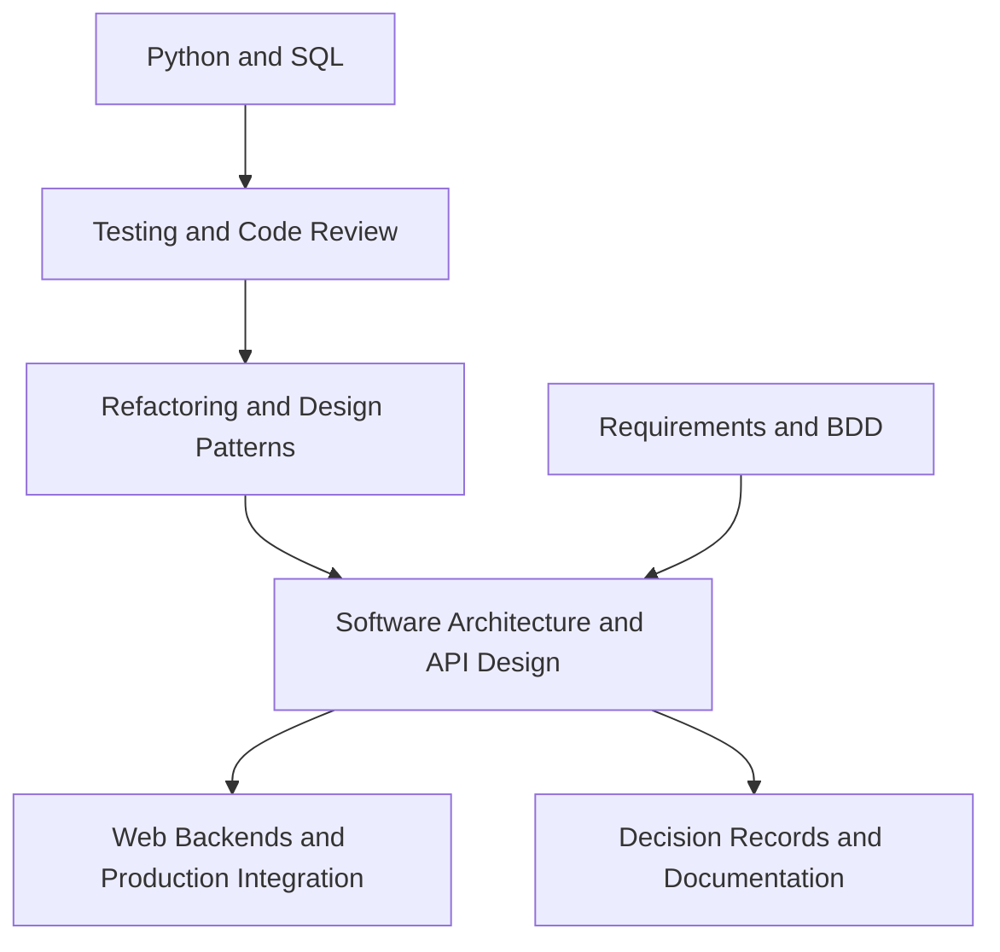

# Software Engineering

Software engineering in this wiki focuses on the contracts that make data and AI systems maintainable: tested behavior, stable APIs, reviewable architecture, safe production integration, and operational documentation.

For AI work, software quality is not separate from model quality. A good model can fail because schemas drift, tests miss edge cases, APIs hide uncertainty, or deployment code cannot be reviewed safely. Use this section to strengthen the ordinary engineering surface around data products, ML services, and generative-AI applications.

## Knowledge map

Implementation and testing come first, then maintainability and architecture, then production integration; requirements and documentation frame the work.

## Reading path

Read implementation and testing, then maintainability and architecture, then production integration, requirements, and documentation.

1. [Python](python.md): typed, tested application code.
2. [SQL](sql.md): safe, parameterized data access.
3. [Testing](testing.md): unit, integration, and property tests.
4. [Code Review](code-review.md): catching defects and sharing context before merge.
5. [Refactoring](refactoring.md): improving structure without changing behavior.
6. [Software Architecture](software-architecture.md): component boundaries and dependencies.
7. [Design Patterns](design-patterns.md): named solutions to recurring design problems.
8. [API Design](api-design.md): stable, validated interface contracts.
9. [Web Backends](web-backends.md): request handling, auth, and validation.
10. [JavaScript Application Architecture](javascript-application-architecture.md): structuring frontends and Node services.
11. [Production Integration](production-integration.md): wiring code safely into live systems.
12. [Requirements Engineering](requirements-engineering.md): turning needs into testable specifications.
13. [Behaviour Driven Development](behaviour-driven-development.md): executable examples of intended behavior.
14. [Technical Decision Records](technical-decision-records.md): recording why a design was chosen.
15. [Documentation](documentation.md): keeping operational knowledge current.

## Connections

- [Data Engineering](../13-data-engineering/index.md) and [ML Engineering and MLOps](../14-ml-engineering-and-mlops/index.md) depend on this engineering discipline to stay maintainable.
