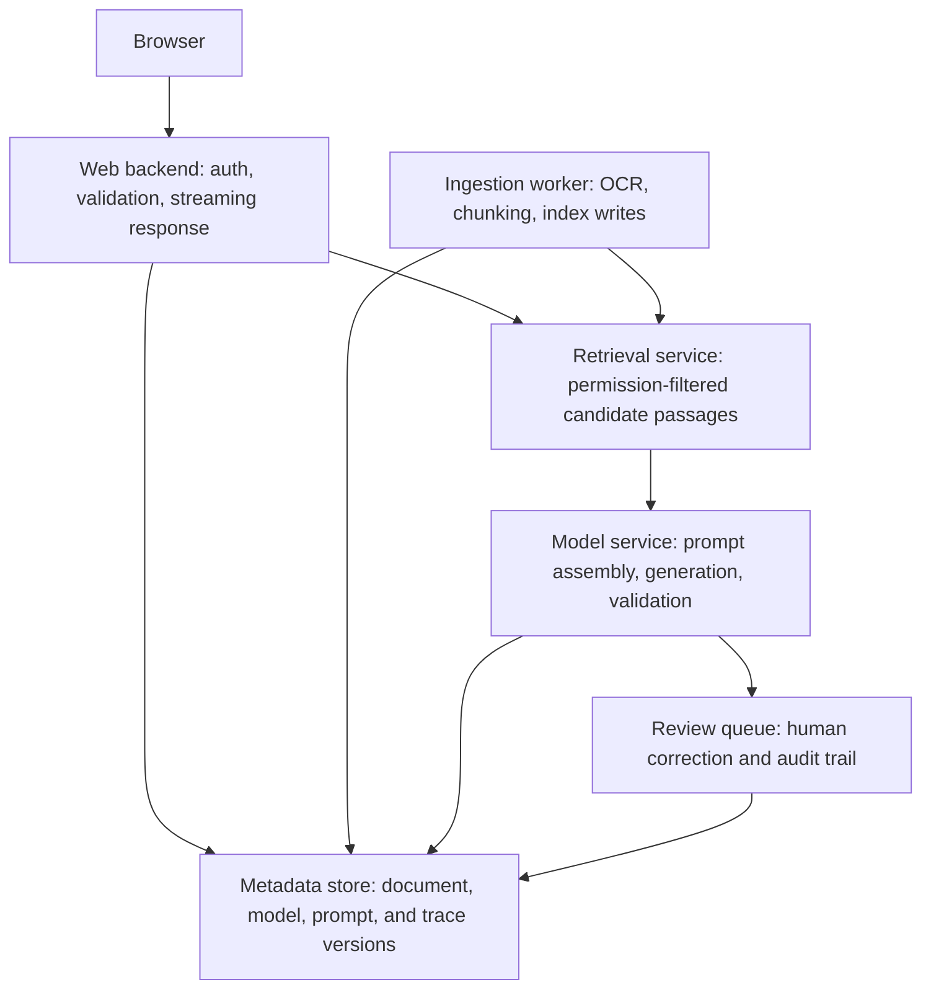

# Software Architecture

Software architecture is the set of structural decisions that make a system easier or harder to change, operate, secure, and scale. It is not the diagram itself; it is the set of boundaries and trade-offs the diagram records. In ML and AI systems, architecture must include data contracts, model versions, evaluation gates, [production integration](production-integration.md), observability, privacy, and rollback.

## Architecture Mechanism

The C4-style view is a useful contract: system context, containers, components, and code. For a document-answering product, the container view might be:

This artifact is not executable, but it is concrete: each arrow implies an [API design](api-design.md) contract, an owner, and a failure mode. A [technical decision record](technical-decision-records.md) should capture why retrieval is a separate service instead of a module inside the backend, especially if it creates a [microservices](../14-ml-engineering-and-mlops/microservices.md) boundary.

## Intuition

Architecture works by making expensive decisions explicit while they can still be discussed. If latency is dominated by model calls, [web backends](web-backends.md) need streaming and cancellation. If privacy is the primary constraint, retrieval and model-serving boundaries must enforce permission checks before context construction. If operational risk is high, the architecture must reserve a rollback path before launch.

## Failure Modes

Architecture fails when diagrams omit runtime behavior, data ownership, or deployment order. A box labeled "AI service" is not enough: name the schema, timeout, retry rule, observability fields, and degradation path. Do not introduce [design patterns](design-patterns.md) or service boundaries unless they reduce a real coupling problem.

## References

- [C4 model](https://c4model.com/)
- [arc42 Template Overview](https://arc42.org/overview)
- [RFC 9110: HTTP Semantics](https://www.rfc-editor.org/rfc/rfc9110.html)

> [!nav]
> **Section** — [Software Engineering](index.md)
>
> [← Refactoring](refactoring.md) [Design Patterns →](design-patterns.md)
