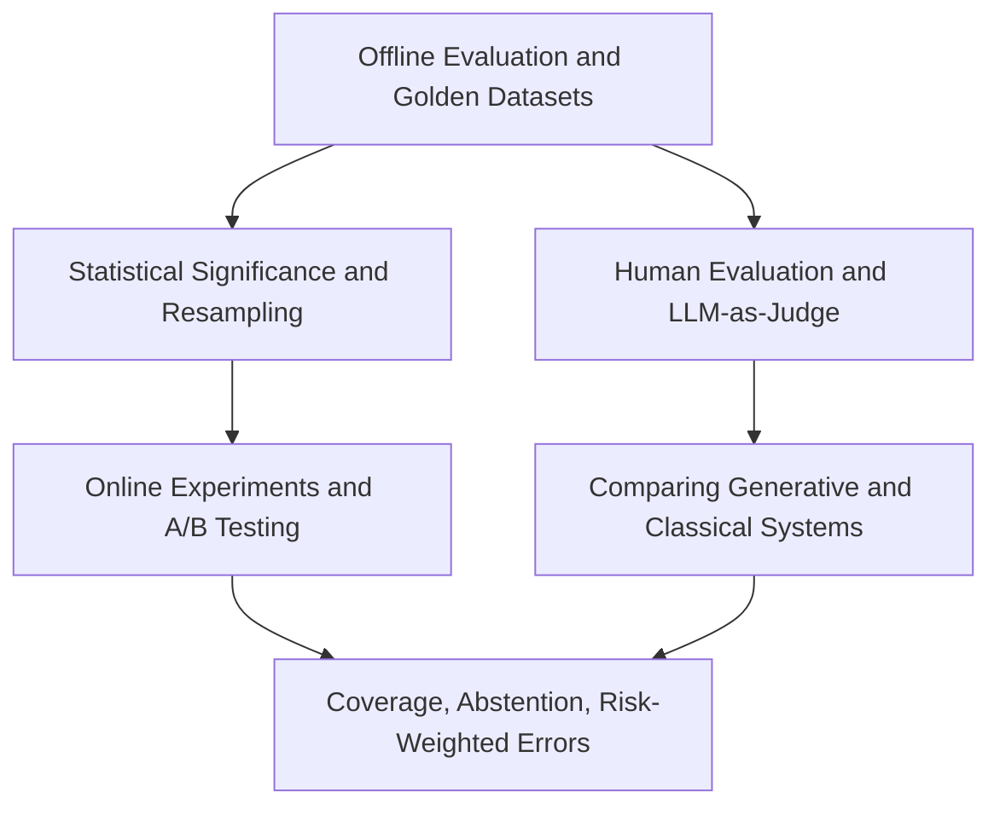

# Experimentation and Evaluation

Experimentation and evaluation turns model behavior into evidence. Offline evaluation estimates behavior before launch, online experiments measure user or business impact under real traffic, and human or model-assisted review handles cases where there is no simple label. The core question is always the same: what decision will this evidence support, and what failure modes would the aggregate metric hide?

This section connects statistical testing from [Probability and Statistics](../02-probability-and-statistics/index.md), forecasting backtests from [Time-Series Forecasting](../05-time-series-and-forecasting/index.md), and production monitoring from [ML Engineering and MLOps](../14-ml-engineering-and-mlops/index.md).

## Knowledge map

Offline evaluation and its statistics feed online experiments; human and model-assisted evaluation handles subjective outputs; risk-aware measures guard safety-sensitive systems.

## Reading path

Read offline evaluation and its statistics, then online experiments, subjective evaluation, and risk-aware measures.

1. [Offline Evaluation](offline-evaluation.md): estimating quality before launch.
2. [Golden Datasets](golden-datasets.md): curated sets that gate critical behavior.
3. [Calibration](calibration.md): whether predicted probabilities match reality.
4. [Statistical Significance](statistical-significance.md): distinguishing signal from noise.
5. [Repeated Sampling](repeated-sampling.md): bootstrap estimates of uncertainty.
6. [Paired Evaluation](paired-evaluation.md): comparing systems on the same items.
7. [Online Experiments](online-experiments.md): measuring impact under real traffic.
8. [A/B Testing](a-b-testing.md): controlled randomized comparison.
9. [Human Evaluation](human-evaluation.md): rubric-based judgment of outputs.
10. [LLM-as-Judge](llm-as-judge.md): using models to score generations.
11. [Comparing Generative AI and Classical ML Systems](comparing-generative-ai-and-classical-ml-systems.md): evaluating fundamentally different systems.
12. [Coverage](coverage.md): how much of the input space is answered.
13. [Abstention](abstention.md): declining to answer when uncertain.
14. [Risk-Weighted Error Taxonomies](risk-weighted-error-taxonomies.md): weighting errors by their real cost.

## Connections

- [Probability and Statistics](../02-probability-and-statistics/index.md) supplies the testing and estimation used here.
- [ML Engineering and MLOps](../14-ml-engineering-and-mlops/index.md) turns this evidence into release gates and monitoring.
