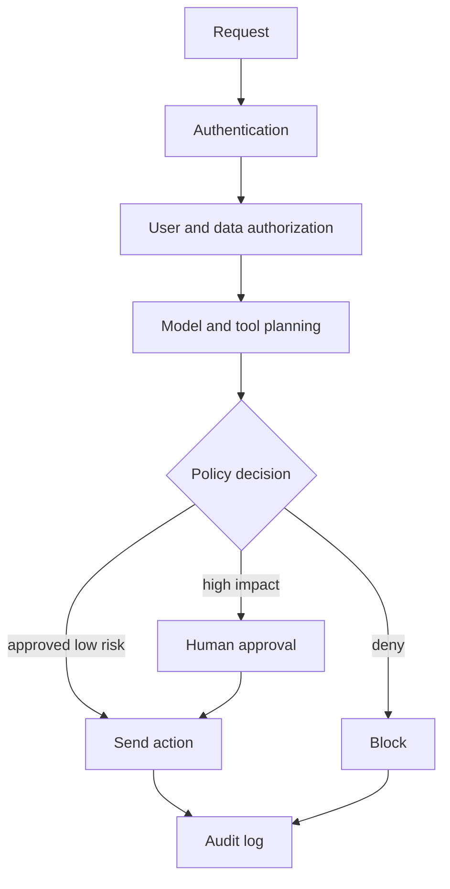

# Policy Enforcement

Policy enforcement turns rules about allowed behavior into runtime controls. In AI systems, policies can be checked before input, during retrieval, before tool execution, after generation, and during [human oversight](human-oversight.md). A prompt instruction is not an enforcement boundary; high-risk decisions should be mediated by code, permissions, or a policy engine.

## Mechanism

A layered enforcement path for an email-sending agent:



The policy must be versioned and testable. For example, a Rego-style rule can deny customer-email actions that lack approval for sensitive content:

```rego
package ai.email

default allow := false

allow if {
  input.action == "send_customer_email"
  input.user_role in {"support_agent", "manager"}
  input.customer_id in input.authorized_customers
  not input.contains_sensitive_claim
}

allow if {
  input.action == "send_customer_email"
  input.user_role == "manager"
  input.customer_id in input.authorized_customers
  input.contains_sensitive_claim
  input.human_approval == true
}
```

OPA's documentation describes Rego as a declarative policy language for structured inputs such as API requests and configuration data. The important AI design point is that the model proposes an action; enforcement code decides whether that action is allowed.

## Sourced artifact

```yaml
policy_test:
  id: email_sensitive_claim_requires_approval
  inputs:
    action: send_customer_email
    user_role: support_agent
    contains_sensitive_claim: true
    human_approval: false
  expected: deny
linked_risks:
  - prompt_injection
  - pii_leakage
  - excessive_agency
```

That test belongs in [adversarial evaluation](adversarial-evaluation.md) and release governance. If a tool path bypasses it, [security](security.md) owns the failure even if the model followed its prompt.

## References

- [Open Policy Agent documentation: Policy Language](https://www.openpolicyagent.org/docs/policy-language)
- [OWASP LLM06:2025 Excessive Agency](https://genai.owasp.org/llmrisk/llm062025-excessive-agency/)
- [NIST AI RMF 1.0](https://nvlpubs.nist.gov/nistpubs/ai/NIST.AI.100-1.pdf)
