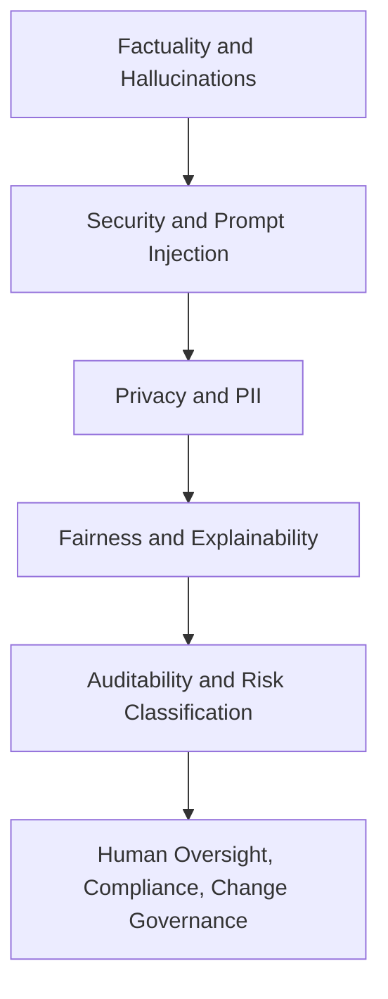

# Responsible AI, Safety, and Governance

This section covers the controls that make AI behavior testable, reviewable, and governable: factuality, privacy, security, fairness, oversight, compliance, audit evidence, and release governance. Responsible AI work is not a separate review at the end of a project; it maps risks to controls throughout the system lifecycle.

## Knowledge map

The section moves from behavior risks (factuality, security, privacy) through fairness and explanation to the governance controls that gate releases.

## Reading path

Read the behavior-safety controls first, then privacy and security, fairness and explanation, and finally governance.

1. [Factual Correctness](factual-correctness.md): checking claims against evidence.
2. [Hallucinations](hallucinations.md): unsupported generated content and its causes.
3. [Error Taxonomies](error-taxonomies.md): structured failure labels that make evaluation actionable.
4. [Adversarial Evaluation](adversarial-evaluation.md): probing for unsafe behavior.
5. [Prompt Injection](prompt-injection.md): untrusted input steering the model.
6. [Security](security.md): protecting the system and its tool use.
7. [Privacy](privacy.md): protecting user and training data.
8. [PII Leakage](pii-leakage.md): detecting and preventing personal-data exposure.
9. [Policy Enforcement](policy-enforcement.md): applying rules at runtime.
10. [Fairness](fairness.md): comparable performance across groups.
11. [Explainability](explainability.md): making decisions inspectable.
12. [Auditability](auditability.md): keeping evidence of what happened and why.
13. [Risk Classification](risk-classification.md): sizing the risk of a system or change.
14. [Human Oversight](human-oversight.md): keeping people in control of consequential actions.
15. [Compliance](compliance.md): meeting legal and regulatory obligations.
16. [Governance of Model and Knowledge Base Changes](governance-of-model-and-knowledge-base-changes.md): traceable approval for updates.

## Connections

- [Generative AI](../11-generative-ai/index.md) provides the guardrails and behaviors these controls constrain.
- [ML Engineering and MLOps](../14-ml-engineering-and-mlops/index.md) supplies the lifecycle gates, and [Experimentation and Evaluation](../17-experimentation-and-evaluation/index.md) the evidence.

> **Learning path — [Generative AI systems](../00-home-and-navigation/learning-paths.md#generative-ai-systems):** ← [RAG Evaluation](../11-generative-ai/rag-evaluation.md)
