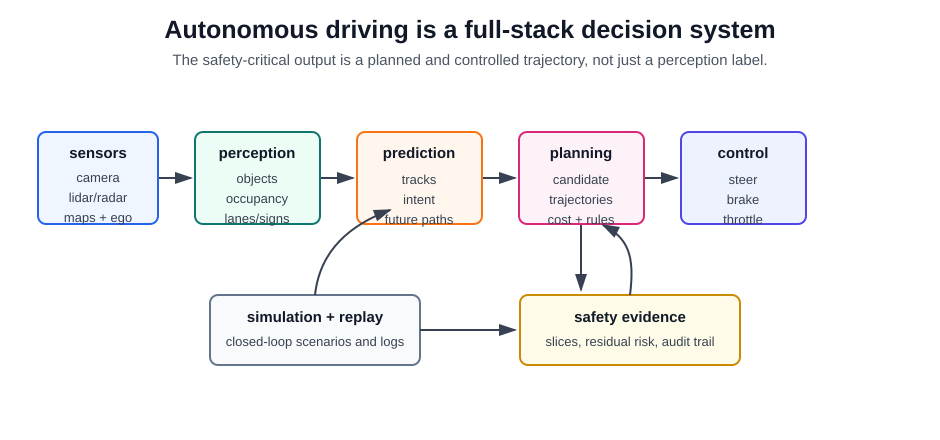

# Autonomous Driving

Autonomous driving is a domain application where perception, prediction, planning, control, mapping, simulation, and safety evaluation must work as one real-time system. The model is not judged only by object-detection accuracy: it must produce a safe trajectory inside an operational design domain, under latency, uncertainty, legal, and human-interaction constraints.

The field spans two deployment families. Driver-assistance systems keep a human responsible for supervision in some or all conditions. Robotaxi or high-automation systems define a constrained operational design domain and ask the automated driving system to handle the dynamic driving task inside that domain. The technical stack should therefore always be described together with its sensors, operating domain, fallback behavior, validation regime, and driver responsibility.

## System Stack

A classical autonomous-driving stack decomposes the problem into modules:

| layer | output | common techniques |
|---|---|---|
| Sensor ingestion | Synchronized camera, lidar, radar, GNSS/IMU, map, and ego-motion streams. | Calibration, timestamp alignment, sensor fusion, rolling-buffer processing. |
| Perception | Objects, lanes, free space, traffic lights, signs, occupancy, and semantic scene state. | [Object detection](../09-computer-vision/object-detection.md), [semantic segmentation](../09-computer-vision/semantic-segmentation.md), 3D detection, BEV transformers, occupancy networks. |
| Tracking and prediction | Actor identities, velocities, interaction state, and future trajectory distributions. | Kalman/particle filters, graph neural networks, transformers, diffusion or mixture trajectory predictors. |
| Mapping and localization | Ego pose, local drivable graph, lanes, crosswalks, route, and construction changes. | HD maps, online map learning, vector-map prediction, SLAM-like localization, map-change detection. |
| Planning | Candidate ego trajectories with collision, comfort, rule, and route costs. | Rule-based planners, optimization, model predictive control, imitation learning, reinforcement learning, end-to-end planners. |
| Control | Steering, throttle, brake, and actuation commands. | PID/LQR/MPC control, learned low-level policies, redundancy and fault handling. |
| Evaluation and safety | Scenario pass/fail, collision risk, rule compliance, interventions, and residual risk. | [Risk-weighted error taxonomies](../17-experimentation-and-evaluation/risk-weighted-error-taxonomies.md), simulation, replay, closed-loop testing, safety cases. |

## State-of-the-Art Method Families

Modern research no longer centers only on separate 2D object detectors. Several representation and training families now matter:

| family | state-of-the-art idea | why it matters |
|---|---|---|
| Bird's-eye-view perception | Multi-camera transformers such as BEVFormer aggregate image features into a top-down spatial grid with temporal memory. | BEV is a common interface for 3D detection, lane reasoning, free-space reasoning, and planning. |
| 3D occupancy prediction | Occupancy benchmarks estimate which voxels are occupied and often what semantic class they contain. | Occupancy represents generic obstacles and geometry better than boxes alone, including unusual or open-set objects. |
| Online vector-map learning | Models such as VectorMapNet predict lane boundaries, dividers, crossings, and road elements as polylines. | Vector maps are closer to what planners need than raster segmentation masks. |
| Planning-oriented multi-task models | UniAD and similar systems connect perception, tracking, prediction, mapping, occupancy, and planning with shared queries. | Optimizing intermediate tasks toward planning can reduce module mismatch and accumulated errors. |
| End-to-end vectorized planners | VAD-style systems use agent and map vectors as structured planning constraints. | They avoid dense raster bottlenecks and make actor/map instances explicit for planning. |
| Foundation-model and VLM approaches | EMMA and DriveLM-style work adapts multimodal or language-facing models to driving outputs or scene reasoning. | They may improve long-tail reasoning and interactivity, but current systems remain expensive and hard to validate for safety. |
| Closed-loop simulation and reactive agents | nuPlan-style evaluation and newer reactive-agent benchmarks test how planners behave when other agents respond. | Open-loop trajectory error is not enough; the planner changes the future it is evaluated in. |

This page is intentionally architecture-neutral. A production system may remain modular for inspectability and safety certification, use learned modules inside a structured stack, or train a more end-to-end model. The main engineering question is not "modular or end-to-end?" but "which interfaces are reliable enough to validate, debug, and constrain?"

## Planning Objective

A planner scores candidate ego trajectories $\tau$ under route, safety, comfort, and rule terms:

$$
J(\tau)=
\lambda_c C_{collision}(\tau)
+\lambda_r C_{route}(\tau)
+\lambda_j C_{jerk}(\tau)
+\lambda_\ell C_{lane}(\tau)
+\lambda_u C_{uncertainty}(\tau).
$$

The selected trajectory is

$$
\tau^*=\arg\min_{\tau\in\mathcal T} J(\tau).
$$

Learned planners may not expose this exact hand-written cost, but the same tradeoffs remain. A planner that overweights route progress may cut too close to pedestrians; a planner that overweights uncertainty may freeze or brake harshly. Safety evaluation should therefore inspect slice-level behavior, not only average displacement error.

## Worked Scenario

Consider an urban left turn with an occluded crosswalk, a cyclist approaching from behind, and a temporary lane closure:

| subsystem | failure-prone question | useful signal |
|---|---|---|
| Perception | Is the partially visible pedestrian a real vulnerable road user or background clutter? | Camera/lidar fusion, occupancy, semantic segmentation, uncertainty. |
| Prediction | Will the cyclist pass on the left before the ego vehicle turns? | Track history, map context, interaction-aware trajectory prediction. |
| Mapping | Is the construction cone changing the drivable corridor? | Online vector-map update and lane-boundary evidence. |
| Planning | Should the vehicle creep, yield, reroute, or commit? | Collision risk, route cost, rule compliance, comfort, and occlusion penalty. |
| Evaluation | Does the model handle this in rain, night, glare, and different cities? | Scenario tags, closed-loop simulation, replay, and [autonomous-driving model evaluation](autonomous-driving-model-evaluation.md). |

This scenario illustrates why autonomous driving is an application rather than a single model. The relevant output is not a label; it is a defensible action under uncertainty with traceable evidence.

## Evaluation

Evaluate at several levels:

| level | examples |
|---|---|
| Perception | 3D detection, segmentation, occupancy IoU, map-element precision, calibration, rare-class recall. |
| Prediction | Multi-modal future accuracy, interaction consistency, miss rate for vulnerable road users. |
| Planning | Collision rate, drivable-area compliance, comfort, route progress, red-light and right-of-way violations. |
| System | Intervention rate, disengagement review, closed-loop simulation, scenario coverage, latency and fallback behavior. |
| Safety case | Operational design domain, residual-risk argument, audit trail, software update process, monitoring and incident review. |

The existing [Autonomous Driving Model Evaluation](autonomous-driving-model-evaluation.md) page goes deeper on scenario slices and risk-weighted evaluation.

## Caveats

Benchmarks are necessary but insufficient. Public datasets cannot cover every city, weather condition, infrastructure style, sensor failure, and adversarial road-user interaction. Closed-loop simulation helps, but simulated agents and assets can be unrealistic. End-to-end systems can reduce hand-coded interfaces, but they make failure attribution and safety arguments harder. Foundation models can add semantic priors, but they must not be treated as a substitute for validated driving competence.

## References

- [Caesar et al., 2019, nuScenes: A multimodal dataset for autonomous driving](https://arxiv.org/abs/1903.11027)
- [Sun et al., 2019, Scalability in Perception for Autonomous Driving: Waymo Open Dataset](https://arxiv.org/abs/1912.04838)
- [Caesar et al., 2021, nuPlan: A closed-loop ML-based planning benchmark for autonomous vehicles](https://arxiv.org/abs/2106.11810)
- [Li et al., 2022, BEVFormer: Learning Bird's-Eye-View Representation from Multi-Camera Images via Spatiotemporal Transformers](https://arxiv.org/abs/2203.17270)
- [Liu et al., 2022, VectorMapNet: End-to-end Vectorized HD Map Learning](https://arxiv.org/abs/2206.08920)
- [Hu et al., 2022, Planning-oriented Autonomous Driving](https://arxiv.org/abs/2212.10156)
- [Jiang et al., 2023, VAD: Vectorized Scene Representation for Efficient Autonomous Driving](https://arxiv.org/abs/2303.12077)
- [Tian et al., 2023, Occ3D: A Large-Scale 3D Occupancy Prediction Benchmark for Autonomous Driving](https://arxiv.org/abs/2304.14365)
- [Sima et al., 2023, DriveLM: Driving with Graph Visual Question Answering](https://arxiv.org/abs/2312.14150)
- [Hwang et al., 2024, EMMA: End-to-End Multimodal Model for Autonomous Driving](https://arxiv.org/abs/2410.23262)
