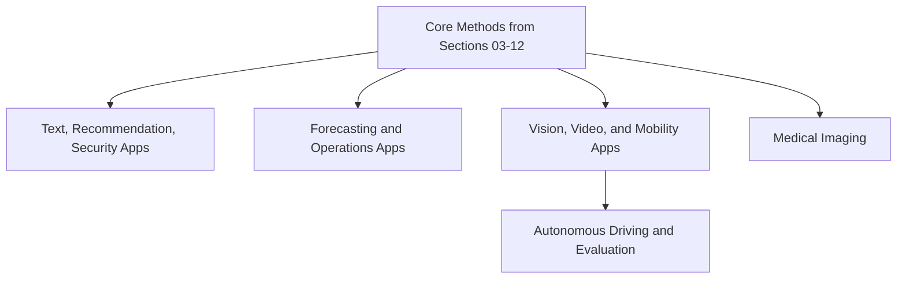

# Domain Applications

Domain applications show how the wiki's modeling, evaluation, and engineering concepts appear in concrete settings. Every page carries the `application` topic so application pages can be found together through tags and backlinks.

Use these pages as integration examples: they show which canonical methods matter in a domain, what the real output contract is, what can go wrong, and which evaluation slices matter.

## Knowledge map

Each application draws on the core methods sections; they group into text/recommendation, forecasting/operations, and vision/mobility (including autonomous driving), plus medical imaging.

## Reading path

The applications group by method family; read whichever cluster matches your interest.

1. [Business Message Classification](business-message-classification.md): text classification for message routing.
2. [News Recommendation](news-recommendation.md): recommendation under freshness and churn.
3. [Matchmaking](matchmaking.md): reciprocal, two-sided recommendation.
4. [Cultural Heritage Document Extraction and Entity Matching](cultural-heritage-document-extraction-and-entity-matching.md): OCR, extraction, and entity linking.
5. [Malware Classification and Clustering](malware-classification-and-clustering.md): security detection and family discovery.
6. [Demand Prediction in Logistics](demand-prediction-in-logistics.md): hierarchical demand forecasting.
7. [Energy Forecasting](energy-forecasting.md): load forecasting under weather and calendar effects.
8. [Predictive Maintenance](predictive-maintenance.md): failure and remaining-useful-life prediction.
9. [Medical MRI Analysis](medical-mri-analysis.md): clinical imaging under validation constraints.
10. [Gesture-Based Interaction](gesture-based-interaction.md): recognizing gestures for interfaces.
11. [Real-Time Action Recognition](real-time-action-recognition.md): low-latency video understanding.
12. [Road Scene Perception](road-scene-perception.md): detection and segmentation for driving.
13. [Autonomous Driving](autonomous-driving.md): the full perception-prediction-planning stack.
14. [Autonomous Driving Model Evaluation](autonomous-driving-model-evaluation.md): safety-focused evaluation of driving models.

## Connections

- [Classical Machine Learning](../03-classical-machine-learning/index.md), [Time-Series Forecasting](../05-time-series-and-forecasting/index.md), [Computer Vision](../09-computer-vision/index.md), and [Recommendation Systems](../04-recommendation-systems/index.md) supply the methods these applications combine.
- [Technical Answer Patterns](../00-home-and-navigation/technical-answer-patterns.md) helps turn these into concise explanations.
