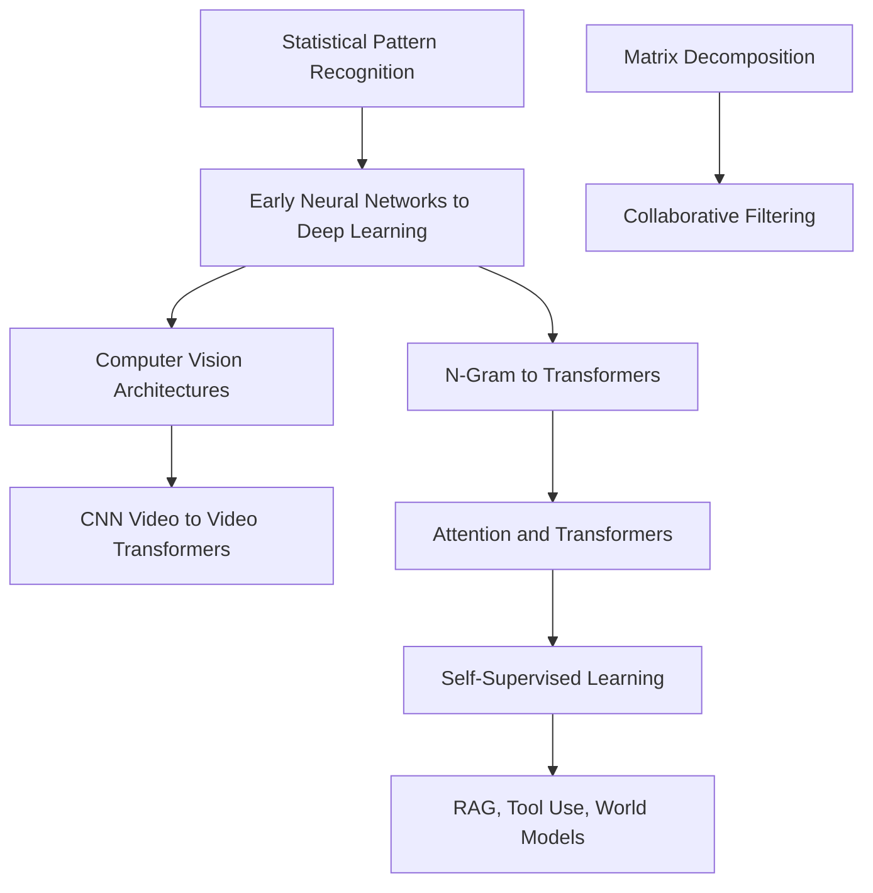

# History of AI and Machine Learning

This section is a sourced chronology map. Each page explains which technical bottleneck came first, which paper or system changed the path, and how that history connects to the wiki's canonical concept pages.

Use the history pages to understand why today's defaults look the way they do. Matrix factorization explains recommender practice, attention history explains transformer design, and self-supervised learning history explains why modern models can scale beyond hand-labeled datasets.

## Knowledge map

Two long threads run through the history: the general classical-to-deep-learning line that branches into vision, language, and self-supervision, and the matrix-methods line behind recommenders.

## Reading path

Read roughly in chronological order, from statistical pattern recognition to modern agents and world models.

1. [Statistical Pattern Recognition to Modern Machine Learning](statistical-pattern-recognition-to-modern-machine-learning.md): the classical statistical roots.
2. [Early Neural Networks to Deep Learning](early-neural-networks-to-deep-learning.md): perceptrons to backpropagation to deep nets.
3. [Matrix Decomposition in Statistics and Recommenders](matrix-decomposition-in-statistics-and-recommenders.md): SVD's path into recommendation.
4. [Evolution of Collaborative Filtering](evolution-of-collaborative-filtering.md): neighborhood methods to latent factors.
5. [Evolution of Computer Vision Architectures](evolution-of-computer-vision-architectures.md): from hand-crafted features to CNNs and beyond.
6. [From CNN Video Models to Video Transformers](from-cnn-video-models-to-video-transformers.md): adding time to vision models.
7. [From N-Gram Language Models to Transformers](from-ngram-language-models-to-transformers.md): counting to neural language modeling.
8. [Development of Attention and Transformers](development-of-attention-and-transformers.md): the architecture that reshaped the field.
9. [Self-Supervised Learning](self-supervised-learning.md): scaling beyond labeled data.
10. [Development of RAG](development-of-rag.md): grounding generation in retrieval.
11. [Development of Tool-Using Language Models and Agents](development-of-tool-using-language-models-and-agents.md): from text generation to action.
12. [World Models and JEPA Background](world-models-and-jepa-background.md): predictive latent models of the world.

## Connections

- [Classical Machine Learning](../03-classical-machine-learning/index.md), [Deep Learning](../06-deep-learning/index.md), and [Generative AI](../11-generative-ai/index.md) are the modern endpoints of these histories.
