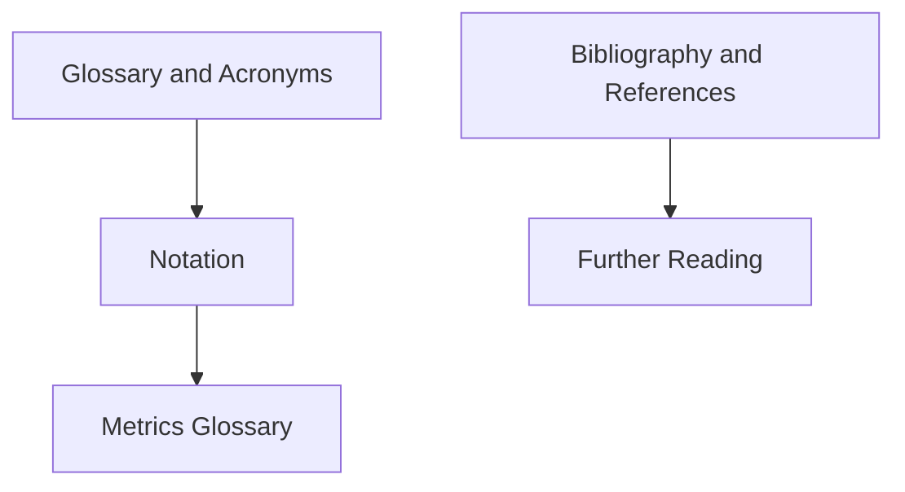

# References and Glossary

References and Glossary is the wiki's lookup and citation spine. It collects definitions, notation, acronyms, bibliography keys, and further-reading routes so concept pages can stay focused while remaining traceable. These pages are reference tools rather than a course, so browse to what you need rather than reading straight through.

## Knowledge map

Terminology tools (glossary, acronyms, notation, metrics) support reading any page; the source tools (bibliography, references, further reading) support going deeper.

## Reading path

Start with terminology, then the source and citation tools.

1. [Glossary](glossary.md): short definitions of recurring terms.
2. [Acronyms](acronyms.md): expansions for abbreviated names.
3. [Notation](notation.md): consistent symbols across math, forecasting, ML, and evaluation.
4. [Metrics Glossary](metrics.md): evaluation metrics with links to their canonical pages.
5. [Bibliography](bibliography.md): the source keys used in page front matter.
6. [References](references.md): the citation conventions and reference index.
7. [Further Reading](further-reading.md): next sources after the wiki overview.

## Maintenance expectations

Reference pages should be boring and stable. Add terms when they appear in several topic pages, keep definitions short, and link to canonical concept pages for depth. Bibliography keys should not be renamed casually because topic pages depend on them.
