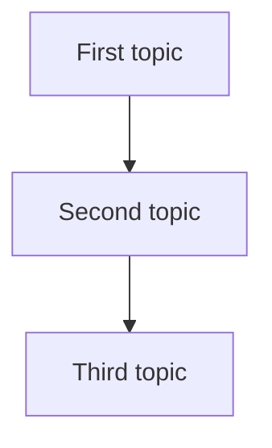

# New Area

One to three paragraphs of high-level orientation: what this section covers, why
it matters, and how its pages relate. This is the section's main page and the
first click, so it should stand on its own.

## Knowledge map

One sentence framing the diagram. The Mermaid graph shows the section's key
topics (or topic groups for large sections) and their internal dependencies, with
arrows pointing from a prerequisite to what it enables. Keep labels plain text
(no parentheses, quotes, or raw `|`).

## Reading path

An ordered list of every non-index page in this section, in a suited reading
order (foundations → methods → evaluation → applied). This list is the single
source of truth for the per-page "Section —" forward/back footers, which are
generated by `scripts/gen-nav-footers.mjs`, so every page in the folder must
appear exactly once with its exact same-folder filename.

1. [First Page](first-page.md): one line on why it comes here.
2. [Second Page](second-page.md): one line on why it comes here.

## Connections

- [Neighboring Area](../NN-other-area/index.md): how this section depends on or
  feeds that one.

## References

Optional: canonical books, standards, or primary sources for the whole area.
